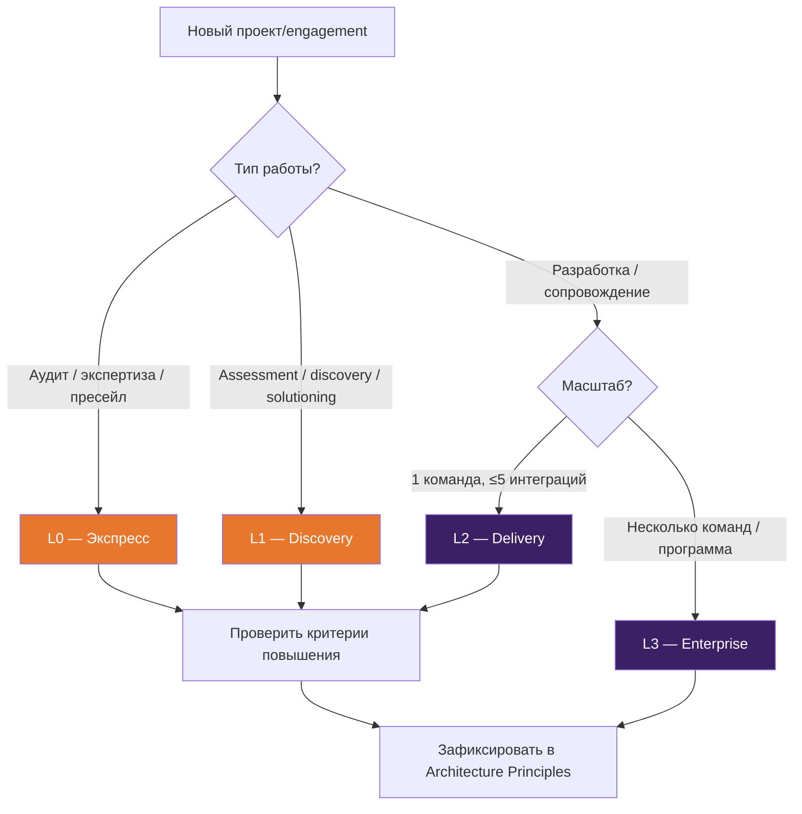

# Architecture Core Standard

## Назначение

Этот документ определяет **обязательный минимум** архитектурной работы на любом проекте. Всё, что здесь описано — не обсуждается: это базовый стандарт качества практики.

Core Standard отвечает на вопрос: **«что архитектор обязан сделать и сдать, независимо от масштаба проекта?»**

---

## Уровни rigor

Каждый проект относится к одному из четырёх уровней. Уровень определяется на [этапе инициации](process.md#2-инициация) и фиксируется в Architecture Principles.

| Уровень | Тип engagement | Длительность | Команда |
|---------|---------------|-------------|---------|
| **L0** — Экспресс | Аудит, пресейл, экспертиза | 1–2 недели | 1 архитектор |
| **L1** — Discovery | Assessment, discovery, solutioning | 2–8 недель | 1–2 архитектора |
| **L2** — Delivery | Разработка, сопровождение | 2+ месяцев | Архитектор(ы) + команда |
| **L3** — Enterprise | Трансформация, программа, платформа | 6+ месяцев | Архитектурная группа |

### Критерии повышения уровня

- Несколько команд → минимум L2
- Интеграция с 5+ системами → минимум L2
- Кросс-организационный scope → L3
- Регуляторные требования (ПДн, ФЗ-152, PCI DSS) → минимум L2

---

## Матрица обязательных артефактов

| Артефакт | L0 | L1 | L2 | L3 | Ответственный |
|----------|:--:|:--:|:--:|:--:|---------------|
| **C4 Context (L1)** | ✅ | ✅ | ✅ | ✅ | [SA](roles.md#solution-architect) |
| **C4 Container (L2)** | — | ✅ | ✅ | ✅ | [SA](roles.md#solution-architect) |
| **ADR** (мин. 3 ключевых решения) | ✅ | ✅ | ✅ | ✅ | [SA](roles.md#solution-architect) |
| **NFR Checklist** | — | ✅ | ✅ | ✅ | [SA](roles.md#solution-architect) |
| **Solution Concept** | — | ✅ | — | — | [SA](roles.md#solution-architect) |
| **Solution Architecture Doc** | — | — | ✅ | ✅ | [SA](roles.md#solution-architect) |
| **Integration Design** | — | — | ✅* | ✅ | [IA](roles.md#integration-architect) |
| **API Specification** | — | — | ✅* | ✅ | [IA](roles.md#integration-architect) |
| **Threat Model** | — | — | ✅* | ✅ | [TA](roles.md#technical-architect-technology-architect) |
| **AI Policy** | — | ✅** | ✅** | ✅ | [SA](roles.md#solution-architect) |
| **Fitness Functions** | — | — | ✅ | ✅ | [TA](roles.md#technical-architect-technology-architect) |
| **Architecture Assessment Report** | ✅*** | ✅*** | — | — | [SA](roles.md#solution-architect) |
| **Tech Debt Register** | — | — | ✅ | ✅ | [TA](roles.md#technical-architect-technology-architect) |
| **Risk Register** | — | ✅ | ✅ | ✅ | [SA](roles.md#solution-architect) |
| **Runtime/Deployment Blueprint** | — | — | ✅ | ✅ | [TA](roles.md#technical-architect-technology-architect) |
| **Data Model** | — | — | ✅* | ✅ | [DA](roles.md#data-architect) |
| **FinOps Assessment** | — | — | ✅* | ✅ | [SA](roles.md#solution-architect) |
| **SLO/SLI Profile** | — | — | ✅ | ✅ | [TA](roles.md#technical-architect-technology-architect) |
| **Architecture Blueprints** (Dev/Ops/Infra) | — | — | — | ✅ | [TA](roles.md#technical-architect-technology-architect) |

\* При наличии соответствующего контекста (API, интеграции, данные, облако).
\*\* Обязательно, если на проекте используются LLM/AI-ассистенты.
\*\*\* Для аудитов и assessment engagement.

---

## Обязательные практики по уровням

| Практика | L0 | L1 | L2 | L3 |
|----------|:--:|:--:|:--:|:--:|
| [ADR](practices.md#1-architecture-decision-records-adr) | ✅ | ✅ | ✅ | ✅ |
| [Architecture Review](practices.md#2-архитектурное-ревью) | — | ✅ | ✅ | ✅ |
| [NFR Management](practices.md#3-работа-с-нефункциональными-требованиями) | — | ✅ | ✅ | ✅ |
| [Fitness Functions](practices.md#4-fitness-functions) | — | — | ✅ | ✅ |
| [Tech Debt Management](practices.md#6-управление-техническим-долгом) | — | — | ✅ | ✅ |
| [Governance](practices.md#7-архитектурный-governance) (автоматический) | — | — | ✅ | ✅ |
| [Governance](practices.md#7-архитектурный-governance) (стратегический) | — | — | — | ✅ |
| [API Governance](practices.md#10-contract-first-api-design) | — | — | ✅ | ✅ |
| [AI Policy](practices.md#9-ai-политика-проекта) | — | ✅* | ✅* | ✅ |
| [Community of Practice](practices.md#18-architecture-community-of-practice) | — | — | — | ✅ |

\* При использовании AI-инструментов.

---

## Профили инструментария по уровням

| Уровень | Инструментарий | Автоматизация |
|---------|---------------|---------------|
| **L0** | Mermaid + Markdown + ADR в Git | — |
| **L1** | + arc42 template, NFR checklist | Markdown lint |
| **L2** | + Structurizr DSL, CI lint, Spectral, OPA/Conftest, fitness functions | CI/CD gates |
| **L3** | + ArchiMate/EAM, Backstage, полный policy-as-code | CI/CD + drift detection |

Подробнее: [Инструменты](tools.md)

---

## Quality Gates

Каждый уровень rigor предполагает прохождение quality gates перед переходом между фазами.

### L0–L1: Минимальные gates

| Checkpoint | Критерий |
|-----------|---------|
| Старт работы | Определён scope и уровень rigor |
| Сдача результата | Все обязательные артефакты готовы, ключевые решения зафиксированы в ADR |

### L2: Delivery gates

| Checkpoint | Критерий |
|-----------|---------|
| После анализа | C4 L1-L2 готовы, NFR собраны и приоритизированы, ≥3 ADR |
| После проектирования | Solution Architecture Doc готов, API specs определены, fitness functions определены |
| Перед релизом | Fitness functions проходят, architecture review проведён, CI gates зелёные |
| Регулярно (каждый спринт) | ADR актуальны, tech debt register обновлён, SLO/SLI определены |

### L3: Enterprise gates

Всё из L2, плюс:

| Checkpoint | Критерий |
|-----------|---------|
| Портфельный review | ARB одобрил ключевые решения, соответствие enterprise standards |
| Кросс-командная синхронизация | Integration design согласован между командами, API контракты зафиксированы |
| Архитектурный drift | Drift detection активен, conformance reports в норме |

Подробнее: [Quality Gates Catalog](quality-gates.md)

---

## Architecture Definition of Done

Любое архитектурное изменение считается **завершённым**, когда:

1. ✅ Обновлена архитектурная модель (C4 / Structurizr)
2. ✅ Зафиксировано решение в ADR (если это значимое изменение)
3. ✅ Обновлены NFR / fitness functions (если затронуты качественные характеристики)
4. ✅ Пройдены автоматические проверки (CI gates)
5. ✅ Проведён architecture review (для изменений выше порога — см. [Decision Rights](governance-charter.md))

---

## Starter Kit

Для быстрого старта на проекте используйте [Architecture Starter Kit](artifacts.md#starter-kit) — шаблон репозитория с предзаполненной структурой, шаблонами ADR, NFR checklist, AI policy и CI-конфигурацией.

---

## Как определить уровень rigor

