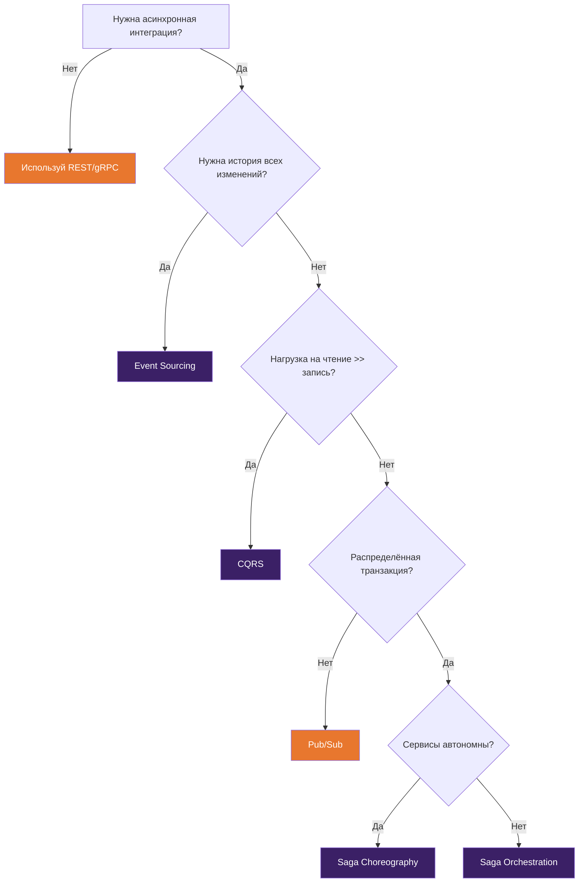
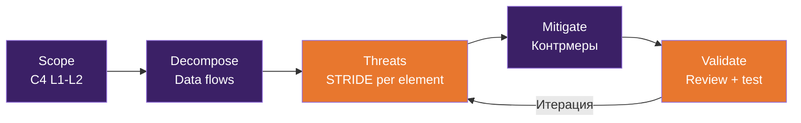

# Ключевые практики и подходы

## Источники

Практики основаны на лучших индустриальных подходах, обогащены результатами исследования state-of-the-art 2024-2026.

---

## 1. Architecture Decision Records (ADR)

**Суть:** каждое значимое архитектурное решение фиксируется с контекстом, вариантами и обоснованием. Один из самых "окупаемых" артефактов - короткий, проверяемый, улучшает continuity при смене людей.

**Когда применять:**
- Выбор технологий и компонентов
- Build/Buy/Reuse решения
- Значимые изменения архитектуры
- Отклонения от принятых стандартов
- Выбор архитектурных паттернов (monolith vs microservices, sync vs async)

**Формат:**

```markdown
# ADR-NNNN: [Заголовок решения]

**Дата:** YYYY-MM-DD
**Статус:** proposed | accepted | deprecated | superseded by ADR-XXXX

## Контекст
Почему вопрос возник. Какие силы влияют на решение.

## Рассмотренные варианты
### Вариант A: [название]
- Плюсы: ...
- Минусы: ...

### Вариант B: [название]
- Плюсы: ...
- Минусы: ...

## Решение
Выбран вариант X, потому что [обоснование].

## Последствия
Что меняется в результате этого решения. Какие риски принимаем.
```

**Инструменты:**
- **adr-tools** (CLI) - рекомендуем как стандарт. Markdown-файлы в Git. См. [ADR-инструменты](tools.md#adr-инструменты)
- **Log4brains** - когда нужен веб-UI для decision log
- Хранение: `/decisions/` в репозитории проекта

**Артефакты:** [Шаблон ADR](artifacts.md#architecture-decision-records-adr) | [Architecture Principles](artifacts.md#architecture-principles)

**AI-усиление:** LLM хорошо генерирует черновики ADR - структурирует варианты, находит trade-offs. Обязательна верификация человеком. См. [промпты для архитекторов](../templates/ai-prompts.md)

---

## 2. Архитектурное ревью

**Суть:** систематическая проверка решений и их реализации. Цель - сервис, а не комитет по запретам.

### Виды ревью

**Design review** - до реализации
- Проверка архитектурного решения перед началом разработки
- Формат: асинхронно через PR в Git (ADR, C4, спецификации) + синхронная сессия для сложных кейсов

**Code review с архитектурным фокусом** - во время реализации
- Проверка соответствия кода архитектуре
- Фокус: границы модулей, контракты, паттерны, NFR

**Architecture assessment** - аудит существующей архитектуры
- Оценка as-is состояния
- AI-усиление: терминальный AI-агент или AI-ассистент в IDE для быстрого reverse engineering

### Lightweight ARB

Современный формат Architecture Review Board для организации на ~200 человек:

**Двухуровневый:**
- Проектный (solution review) - лёгкий, по запросу, асинхронный через PR
- Стратегический (portfolio/EA) - редкий (раз в месяц), для принципиальных решений

**Формат:**
- Timeboxed "office hours" - 60-90 минут в неделю
- Асинхронные ревью по артефактам в Git (PR-подход)
- Чеклисты по pillars: reliability, security, cost, performance, sustainability
- [Чеклисты для ревью](../templates/architecture-review.md)

**Критерии ревью:**
- Соответствие NFR
- Соблюдение архитектурных принципов проекта
- Build/Buy/Reuse обоснованность
- Cost model (FinOps)
- Security posture (Zero Trust)
- Sustainability impact (для крупных решений)

---

## 3. Работа с нефункциональными требованиями

**Суть:** систематическое выявление, документирование и проверка NFR. Применяется на [этапе анализа](process.md#3-анализ-архитектуры).

**Расширенные категории NFR:**

| Категория | Что проверяем | Как измеряем |
|-----------|-------------|-------------|
| Scalability | Масштабируемость нагрузки | RPS, concurrent users, data volume |
| Performance | Производительность | Latency (p50/p95/p99), throughput |
| Availability | Доступность | SLA %, RTO, RPO |
| Recoverability | Восстанавливаемость | Backup/restore time, disaster recovery |
| Security | Безопасность | Threat model, Zero Trust compliance |
| Maintainability | Сопровождаемость | Code complexity, deployment frequency |
| Operability | Операбельность | Observability coverage, runbook completeness |
| **Cost** | Стоимость владения (FinOps) | Monthly cost, cost per transaction |
| **Sustainability** | Углеродный след | SCI score (Software Carbon Intensity) |

**Подход:**
1. Сбор NFR на этапе анализа ([чеклист по категориям](artifacts.md#nfr-checklist))
2. Приоритизация совместно с заказчиком (не все NFR одинаково важны)
3. Трансляция NFR в архитектурные решения и [ADR](artifacts.md#architecture-decision-records-adr)
4. Определение [fitness functions](artifacts.md#fitness-functions) для автоматической проверки
5. Верификация через [тестирование архитектуры](process.md#6-тестирование-архитектуры)

---

## 4. Fitness Functions

**Суть:** автоматизированные проверки, что архитектура соответствует заявленным характеристикам. Вместо "архитектура должна быть хорошей" - конкретные проверяемые правила. Определяются на [этапе анализа](process.md#3-анализ-архитектуры), включаются в CI на [этапе реализации](process.md#5-реализация).

**Зрелость:** early adopter → mainstream. Thoughtworks активно продвигает как ключевой элемент evolutionary architecture.

**Примеры fitness functions:**
- Latency budget: p99 < 200ms для API
- Зависимости: модуль A не импортирует модуль B напрямую
- API контракты: все endpoints описаны в OpenAPI и проходят автоматический линтинг
- Шифрование: все данные at rest зашифрованы (проверяется через OPA/Conftest)
- Стоимость: monthly cost < бюджет (FinOps alert)
- Тесты: coverage > 80% для critical paths

**Реализация:**
- CI/CD pipeline checks
- OPA/Conftest для IaC — см. [Policy-as-code](tools.md#infrastructure-as-code)
- [Линтер API-спецификаций](tools.md#contract-first-подход)
- ArchUnit / dependency-cruiser для проверки границ модулей
- Cloud cost alerts

**Артефакты:** [Определение fitness functions](artifacts.md#fitness-functions) | [NFR Checklist](artifacts.md#nfr-checklist)

**На проекте:** определяем 5-15 fitness functions на этапе анализа, включаем в CI.

---

## 5. Оценка и выбор технологий

**Суть:** структурированный процесс выбора компонентов, платформ и инструментов. Применяется [Solution Architect](roles.md#solution-architect) на этапах [анализа](process.md#3-анализ-архитектуры) и [проектирования](process.md#4-проектирование-архитектуры).

**Когда полная оценка обязательна:**
- Выбор СУБД, message broker, API gateway
- Build vs Buy vs SaaS для ключевых компонентов
- Выбор облачного провайдера или платформы
- Переход между архитектурными стилями (monolith → microservices)

**Шаги:**
1. Определить критерии оценки (включая cost, security, sustainability)
2. Определить веса критериев
3. Идентифицировать альтернативы (в т.ч. через AI для расширения пространства поиска)
4. Оценить каждую альтернативу (PoC для ключевых рисков). Для packaged solutions — [Fit/Gap Analysis](artifacts.md#fitgap-analysis)
5. Зафиксировать результат в [ADR](artifacts.md#architecture-decision-records-adr)

**Критерии выбора архитектурного стиля:**

| Фактор | Modular Monolith | Microservices | Cell-based |
|--------|-----------------|--------------|------------|
| Размер команды | < 30 | > 30 | > 100 |
| Зрелость DevOps | Начальная | Продвинутая | Зрелая |
| Независимое масштабирование | Не нужно | Нужно | Нужно + blast radius |
| Скорость выхода | Быстро | Медленнее (infra overhead) | Ещё медленнее |
| Рекомендация | По умолчанию, "monolith first" | Когда есть реальная причина | Highload, multi-tenant |

---

## 6. Управление техническим долгом

**Суть:** осознанное отслеживание и контроль компромиссов в архитектуре. Основная активность на [этапе сопровождения](process.md#8-сопровождение), ведёт [Technical Architect](roles.md#technical-architect-technology-architect).

**Инструменты:**
- Инструмент поведенческого анализа кода - hotspots, "где риск и стоимость изменений максимальны"
- Анализатор качества кода - измеримый техдолг, оценка стоимости устранения
- **DORA-метрики** (актуальный набор 2024–2026, 5 метрик):

| Метрика | Что измеряет | Связь с архитектурой |
|---------|-------------|---------------------|
| Deployment Frequency | Как часто код попадает в прод | Модульность, CI/CD pipeline, слабая связность |
| Lead Time for Changes | От commit до прода | Автоматизация pipeline, размер сервисов, тестируемость |
| Change Failure Rate | % деплоев, вызвавших инцидент | Качество тестов, fitness functions, canary/blue-green |
| Time to Restore (MTTR) | Время восстановления после инцидента | Observability, rollback strategy, blast radius |
| **Deployment Rework Rate** | % деплоев, требующих hotfix/rollback | Качество architecture review, tech debt уровень |

> Deployment Rework Rate выделена как отдельная метрика в DORA 2024. Она лучше отражает «стабильность архитектуры», чем Change Failure Rate, т.к. измеряет именно «переделки» после деплоя.

**Артефакты:** [Tech Debt Register](../templates/tech-debt-register.md) — стандартный реестр для ведения техдолга.

**Архитектурный техдолг vs обычный:**
- **Критичный** (связан с масштабированием/безопасностью/надёжностью/стоимостью) - планируем устранение
- **Допустимый** (осознанный trade-off) - фиксируем в ADR, мониторим, пересматриваем

**Подход:**
- Фиксация техдолга при принятии решений (в ADR: "принимаем X как техдолг, потому что...")
- Ведение [Tech Debt Register](../templates/tech-debt-register.md) с владельцами и оценкой
- Инструменты анализа кода интегрированы в архитектурные ревью
- Оценка стоимости устранения
- Приоритизация совместно с product owner (15–20% capacity на техдолг)
- Регулярный пересмотр (каждый релиз / квартал)

---

## 7. Архитектурный governance

**Суть:** обеспечение соответствия реализации архитектуре. Быстрый, измеримый, по возможности автоматизированный. Инструменты: [fitness functions](#4-fitness-functions), [policy-as-code](tools.md#infrastructure-as-code), [архитектурное ревью](#2-архитектурное-ревью).

**Три уровня governance:**

| Уровень | Что | Как | Частота |
|---------|-----|-----|---------|
| Автоматический | Fitness functions, API linting, policy-as-code | CI/CD | На каждый commit |
| Проектный | Design review, ADR approval | PR в Git + office hours | По необходимости |
| Стратегический | Portfolio decisions, EA principles | ARB meeting | Ежемесячно |

**Architecture observability - как отслеживать соответствие:**
- **Runtime-телеметрия:** OpenTelemetry (traces/metrics/logs)
- **Каталог компонентов:** Backstage (ownership, metadata, docs)
- **Drift detection:** Terraform drift detection + OPA policy enforcement
- Итог: архитектор отвечает "соответствует ли реальность?" не документом, а наблюдаемыми сигналами

---

## 8. Архитектурная коммуникация

**Суть:** умение доносить решения до разных аудиторий в подходящем формате.

| Аудитория | Что показывать | Как | Инструменты |
|-----------|---------------|-----|------------|
| Бизнес-заказчик | Бизнес-контекст, границы, риски, стоимость | C4 Level 1, презентации | Miro, slides |
| Менеджмент проекта | Зависимости, риски, прогресс, бюджет | Статусные отчёты, roadmap | Confluence, Jira |
| Команда разработки | Компоненты, интерфейсы, стандарты | C4 Level 2-3, ADR, wiki | Git, MkDocs |
| Команда эксплуатации | Инфраструктура, мониторинг, процедуры | Operations Blueprint, runbooks | Backstage, wiki |
| Архитектурное сообщество | Решения, паттерны, lessons learned | ADR, tech talks, radar | Guild meetings |

---

## 9. AI-политика проекта

**Суть:** явные правила использования AI на проекте. Не факультативно - обязательный артефакт.

**Содержание AI-политики:**

**Разрешено:**
- Черновики документов, ADR, вариантов решений
- Анализ открытого кода и документации
- Генерация диаграмм и спецификаций
- Code review с AI-ассистентом

**Запрещено (красные зоны):**
- PII, персональные данные
- Коммерческие тайны клиента
- Secrets, ключи, пароли
- Данные под NDA без согласования

**Верификация:**
- Все AI-генерированные решения проверяются человеком
- AI-генерированный код проходит стандартный code review
- ADR, созданные с помощью AI, маркируются (AI-assisted)

**Инфраструктура:**
- Предпочтение корпоративным инстансам (Azure OpenAI, Anthropic API)
- MCP для подключения к корпоративным данным
- Логирование использования (audit trail)

### AI Quality & Safety

**Классификация данных для AI-контекста:**

| Класс | Описание | Можно отправлять в LLM | Примеры |
|-------|---------|:---:|---------|
| 🟢 Public | Открытая информация | ✅ Любой LLM | Документация, open source код, публичные API |
| 🟡 Internal | Внутренняя информация | ⚠️ Только корпоративный LLM | Внутренний код, архитектурные решения, ADR |
| 🔴 Confidential | Конфиденциальная | ❌ Нет* | PII, коммерческие тайны, данные клиентов |
| ⚫ Restricted | Регулируемая | ❌ Никогда | Secrets, ключи, данные под NDA, PCI DSS |

\* Допускается только в on-premise LLM с соответствующей сертификацией.

**OWASP LLM Top 10 — маппинг на архитектурные решения:**

| Риск OWASP | Архитектурное решение |
|-----------|---------------------|
| Prompt Injection | Валидация входов, system prompt protection, output sanitization |
| Insecure Output Handling | Не доверять output LLM как безопасному, sanitize перед использованием |
| Training Data Poisoning | Использовать только trusted модели (enterprise endpoints) |
| Denial of Service | Rate limiting, timeout на вызовы LLM, cost alerts |
| Supply Chain Vulnerabilities | Аудит MCP-серверов, pinned versions, trusted sources |
| Sensitive Information Disclosure | Data classification, input filtering, audit trail |
| Insecure Plugin Design | MCP-серверы: least privilege, sandbox, явные permissions |
| Excessive Agency | Human-in-the-loop для критичных действий, нет авто-деплоя |
| Overreliance | Обязательная верификация человеком, маркировка AI-generated |
| Model Theft | Enterprise endpoints, нет fine-tuned моделей без защиты |

**Требования к MCP-серверам:**
- Принцип least privilege: MCP-сервер получает доступ только к необходимым ресурсам
- Запрет на комбинацию filesystem + git + execute в одном MCP без sandbox
- Журналирование всех tool calls (кто, когда, какой инструмент, какие данные)
- Версионирование и аудит конфигурации MCP-серверов
- Регулярный review подключённых MCP-серверов (ежеквартально)

**AI Audit Trail:**
- Что логируется: цель промпта, класс данных, используемый toolchain, результат (accept/reject)
- Где хранится: Git (для ADR/артефактов) + centralized log (для operational use)
- Как ревьюится: выборочный audit при architecture review, полный audit для Confidential+ данных

[Шаблон AI-политики](../templates/ai-policy.md) | [Промпты для архитекторов](../templates/ai-prompts.md)

---

## 10. Contract-first API Design

**Суть:** сначала контракт (спецификация), потом реализация. Валидация сдвигается "влево". Ведёт [Integration Architect](roles.md#integration-architect).

**Стандарты:** OpenAPI 3.1.x (REST, baseline), AsyncAPI 3.0 (events), CloudEvents (event format). Отслеживать OpenAPI 3.2.x (2025+) для планирования обновления.

**Минимальный пакет:**
1. Спецификация в Git (OpenAPI/AsyncAPI YAML) — [шаблон API Specification](artifacts.md#api-specifications)
2. Style guide как набор правил линтера (naming, versioning, error format) — см. [инструменты](tools.md#contract-first-подход)
3. Автоматический линтинг в CI
4. [ADR](artifacts.md#architecture-decision-records-adr) на ключевые API-решения (версионирование, аутентификация, rate limiting)

**Baseline Spectral ruleset (минимальные правила):**
- `operation-operationId` — каждый endpoint имеет operationId
- `operation-description` — каждый endpoint имеет описание
- `oas3-valid-schema-example` — examples соответствуют schema
- `path-params` — path parameters определены
- `no-$ref-siblings` — нет невалидных $ref
- `info-contact` — API имеет контактную информацию
- Naming: camelCase для properties, kebab-case для paths
- Error format: стандартный RFC 7807 (Problem Details)

**Versioning policy:**
- Формат версии: semver в URL (`/v1/`, `/v2/`) для major, header для minor
- Breaking changes: обязательный ADR + migration guide + deprecation period (≥3 месяца)
- Breaking change detection: oasdiff / optic в CI (блокирует merge при undocumented breaking change)
- Deprecation: endpoint помечается `deprecated: true`, добавляется `Sunset` header

**API Review checklist:**
- [ ] Все endpoints задокументированы (description + examples)
- [ ] Спецификация проходит Spectral lint без ошибок
- [ ] Error responses стандартизированы (RFC 7807)
- [ ] Authentication/authorization описаны (securitySchemes)
- [ ] Rate limiting определён
- [ ] Versioning strategy зафиксирован в ADR
- [ ] Breaking changes detection включён в CI

---

## 11. Data Contracts & Data Governance

**Суть:** формализованное соглашение между поставщиком и потребителем данных. Data contract определяет schema, ownership, quality SLA и правила версионирования — аналог API-контракта, но для данных.

**Когда применять:**
- Data mesh / data products — обязательно
- Интеграции между доменами через данные (ETL, streaming)
- Data warehouse / data lake — контракт на входные данные
- ML pipelines — контракт на training data

### Data Contract — что фиксируем

| Элемент | Описание | Пример |
|---------|---------|--------|
| **Schema** | Структура данных, типы полей, constraints | JSON Schema, Avro, Protobuf |
| **Ownership** | Кто владеет данными, кто поддерживает контракт | Доменная команда, Data Owner |
| **SLA** | Гарантии качества: freshness, completeness, latency | Данные обновляются каждые 5 мин, completeness ≥ 99.5% |
| **Versioning** | Правила изменения контракта | Semver, backward compatibility обязательна |
| **Access** | Кто и как может читать данные | RBAC, API keys, row-level security |
| **Lineage** | Откуда данные, как трансформированы | Source → transformation → target |

### Data Quality Metrics

| Метрика | Что измеряет | Как проверять |
|---------|-------------|--------------|
| **Freshness** | Данные актуальны | Timestamp последнего обновления vs SLA |
| **Completeness** | Нет пропущенных обязательных полей | % NULL в обязательных полях < threshold |
| **Consistency** | Данные согласованы между источниками | Cross-source validation checks |
| **Accuracy** | Данные корректны | Spot-check, reconciliation с источником |
| **Uniqueness** | Нет дубликатов | Duplicate detection по primary key |
| **Timeliness** | Данные доставлены вовремя | Pipeline completion time vs SLA |

### Data Mesh — decision framework

| Фактор | Централизованное хранилище | Data Mesh |
|--------|:---:|:---:|
| Количество доменов | < 5 | > 5 |
| Команды | Одна data team | Доменные команды с data ownership |
| Размер организации | < 100 человек | > 100 человек |
| Data maturity | Начальная | Продвинутая |
| Скорость изменений | Низкая | Высокая |
| Рекомендация | По умолчанию, проще в управлении | Когда централизация стала bottleneck |

> Data mesh — не технология, а организационный подход. Без самоуправляемой data-платформы и data contracts data mesh превращается в хаос.

**Data Lineage** — отслеживание происхождения и трансформации данных:
- Зачем: compliance (GDPR/ПДн), debugging, impact analysis
- Как: metadata management tools, OpenLineage (open standard)
- Минимум: документировать source → transformation → target для критичных data pipelines

**Связь с другими практиками:**
- [API Governance](#10-contract-first-api-design) — data contract расширяет API-контракт для data products
- [SLO/SLI Profile](../templates/slo-sli-profile.md) — SLO для data pipelines (freshness, latency)
- [Fitness Functions](#4-fitness-functions) — data quality checks как fitness functions в CI/CD
- [Core Standard](core-standard.md) — data contracts обязательны на [уровне L3](core-standard.md#уровни-rigor)

**Артефакты:** [Data Contract](../templates/data-contract.md) | [Data Model](../templates/data-model.md)

---

## 12. Event-Driven Architecture (EDA)

**Суть:** проектирование систем, где компоненты взаимодействуют через события. EDA governance обеспечивает совместимость, обнаруживаемость и надёжность событий в масштабе. Ведёт [Integration Architect](roles.md#integration-architect).

### Event Taxonomy

Три уровня событий с разными правилами governance:

| Тип | Описание | Scope | Governance |
|-----|---------|-------|-----------|
| **Domain Events** | Факт, произошедший в бизнес-домене | Внутри bounded context | Владелец домена |
| **Integration Events** | Событие для взаимодействия между сервисами/доменами | Кросс-доменный | [Integration Architect](roles.md#integration-architect), schema registry |
| **System Events** | Инфраструктурные события (health, scaling, alerts) | Platform | DevOps / [TA](roles.md#technical-architect-technology-architect) |

### CloudEvents — стандарт envelope

CloudEvents (CNCF graduated) — стандартный формат описания событий. Обязательные атрибуты:

```yaml
# CloudEvents обязательные атрибуты
specversion: "1.0"
type: "com.example.order.created"       # Тип события (reverse DNS)
source: "/orders/service"                # Источник
id: "A234-1234-1234"                     # Уникальный ID
time: "2025-03-15T10:30:00Z"             # Timestamp
datacontenttype: "application/json"      # Формат payload
```

**Naming conventions:**
- Формат: `{org}.{domain}.{entity}.{action}` (reverse DNS)
- Action: past tense (`created`, `updated`, `deleted`, `failed`)
- Примеры: `com.acme.orders.order.created`, `com.acme.inventory.stock.reserved`

### Schema Registry & Versioning

**Schema Registry** — централизованное хранилище схем событий:
- Зачем: единый источник истины для event schemas, совместимость, обнаруживаемость
- Инструменты: Confluent Schema Registry, AWS Glue Schema Registry, Apicurio
- Форматы: Avro (рекомендуется для Kafka), Protobuf, JSON Schema

**Стратегии совместимости:**

| Стратегия | Описание | Когда использовать |
|-----------|---------|-------------------|
| **Backward** | Новая schema читает старые данные | По умолчанию (рекомендовано) |
| **Forward** | Старая schema читает новые данные | Когда consumers обновляются медленно |
| **Full** | Backward + Forward | Для критичных событий |
| **None** | Без проверки | Только для dev/test |

**Правила версионирования событий:**
- Добавление опционального поля — backward compatible (OK)
- Удаление поля — breaking change (требует новую версию типа события)
- Изменение типа поля — breaking change
- Breaking changes: новый тип события + deprecation period для старого (≥3 месяца)

### EDA Patterns — decision framework

| Паттерн | Когда применять | Сложность | Типичный стек |
|---------|----------------|:---------:|--------------|
| **Pub/Sub** | Рассылка уведомлений, loose coupling | Low | Kafka, RabbitMQ, SNS |
| **Event Sourcing** | Аудит, temporal queries, rebuild state | High | Kafka, EventStoreDB |
| **CQRS** | Разные модели для чтения и записи, high-read | Medium | Отдельные read/write stores |
| **Saga (Choreography)** | Распределённые транзакции, автономные сервисы | High | Events + компенсации |
| **Saga (Orchestration)** | Распределённые транзакции, центральный координатор | Medium | Orchestrator + commands |
| **Outbox** | Гарантированная доставка событий из СУБД | Medium | DB + CDC (Debezium) |
| **Dead Letter Queue** | Обработка failed events | Low | DLQ + monitoring |

**Decision flow:**



### Anti-patterns

| Anti-pattern | Проблема | Решение |
|-------------|---------|---------|
| **Event as command** | Событие содержит «что делать» вместо «что произошло» | Событие = факт (past tense), command = отдельный канал |
| **God event** | Одно событие несёт слишком много данных | Разделить на domain-specific events |
| **Missing idempotency** | Повторная обработка создаёт дубликаты | Idempotency key + deduplication |
| **Tight temporal coupling** | Consumer ожидает event в определённый момент | Design for eventual consistency |
| **No dead letter queue** | Failed events теряются | DLQ + мониторинг + retry policy |
| **Schema evolution без registry** | Несовместимость при обновлении | Schema registry + compatibility checks |

**Связь с другими практиками:**
- [API Governance](#10-contract-first-api-design) — AsyncAPI для event-контрактов, Spectral lint
- [Data Contracts](#11-data-contracts--data-governance) — schema событий = часть data contract
- [Fitness Functions](#4-fitness-functions) — event delivery latency, consumer lag как fitness functions
- [Integration Design](artifacts.md#integration-design) — EDA-потоки в integration design

**Артефакты:** [EDA Decision Record](../templates/eda-decision-record.md) | [Integration Design](../templates/integration-design.md) | [API Specification (AsyncAPI)](../templates/api-specification.md)

---

## 13. Green Architecture & Sustainability

**Суть:** проектирование систем с учётом экологического воздействия. Sustainability — архитектурный атрибут наравне с performance и cost. Актуально для организаций с ESG-отчётностью, публичных сервисов с большой пользовательской базой и cloud-native систем с масштабируемой инфраструктурой.

### Software Carbon Intensity (SCI)

SCI (ISO/IEC 21031:2024) — стандартная метрика углеродной интенсивности ПО от Green Software Foundation.

**Формула:**

```text
SCI = ((E × I) + M) / R
```

| Компонент | Описание | Как измерить |
|-----------|---------|-------------|
| **E** | Энергопотребление (кВт·ч) | Cloud Carbon Footprint, Kepler, RAPL |
| **I** | Углеродная интенсивность электросети (gCO₂/кВт·ч) | Electricity Maps API, WattTime |
| **M** | Embodied emissions (производство оборудования) | Спецификации вендора, CCF defaults |
| **R** | Функциональная единица | Транзакция, пользователь, API call |

**Пример:** SCI = ((0.005 кВт·ч × 400 gCO₂/кВт·ч) + 0.1 g) / 1 API call = 2.1 gCO₂/call

**Связь SCI с архитектурными решениями:**

| Решение | Влияние на SCI | Компонент SCI |
|---------|---------------|---------------|
| Выбор региона с «зелёной» энергией | Снижает I (углеродная интенсивность) | I |
| Autoscaling до нуля (scale-to-zero) | Снижает E (энергия в idle) | E |
| Batch вместо real-time processing | Demand shifting на «чистые» часы | E × I |
| ARM-based instances (Graviton) | ~40% меньше энергии на vCPU | E |
| Serverless вместо always-on | Оплата и потребление только при нагрузке | E |
| Оптимизация размера данных | Меньше storage, network, compute | E |
| Увеличение срока жизни оборудования | Снижает amortized M | M |

### Carbon-Aware Architecture Patterns

**Demand Shifting** — перенос нагрузки на периоды с низкой углеродной интенсивностью:
- Batch jobs запускаются когда grid carbon intensity < порога
- Инструменты: Carbon Aware SDK (Green Software Foundation), WattTime API
- Применимо: ML training, data pipelines, отчёты, backups

**Demand Shaping** — адаптация качества сервиса к текущей углеродной интенсивности:
- Снижение разрешения видео, сжатие изображений, упрощение рекомендаций
- Применимо: media streaming, CDN, recommendation engines

**Proximity patterns:**
- Edge computing — обработка ближе к пользователю (меньше network hops)
- Data locality — данные и compute в одном регионе
- CDN caching — снижение нагрузки на origin

### Green Architecture Decision Framework

**Когда sustainability — приоритет:**
- Организация ведёт ESG-отчётность (обязательно для публичных компаний в ЕС с 2025)
- Публичные сервисы с миллионами пользователей (высокий масштаб = высокий impact)
- Cloud-native системы с переменной нагрузкой (потенциал для demand shifting)
- Государственные и регулируемые отрасли (растущие требования к sustainability)

**Trade-offs:**

| Архитектурный выбор | Performance / Availability | Sustainability | Рекомендация |
|--------------------|--------------------------:|:--------------:|-------------|
| Multi-region active-active | Высокая доступность | Дублирование ресурсов ↑ | Только при SLA > 99.99% |
| Sync real-time processing | Низкая латентность | Постоянное потребление ↑ | Только для user-facing critical path |
| Over-provisioning | Запас для пиков | Idle ресурсы ↑ | Заменить автоскейлингом |
| Кэширование | Ускорение ответа | Снижение compute ↓ | Всегда полезно для обоих |
| Serverless / scale-to-zero | Возможен cold start | Нет idle потребления ↓ | По умолчанию для event-driven |

**Чеклист для architecture review (sustainability):**
- [ ] Выбран регион с учётом углеродной интенсивности энергосети
- [ ] Compute масштабируется до нуля при отсутствии нагрузки
- [ ] Batch-задачи могут быть перенесены на «чистые» часы (demand shifting)
- [ ] Неиспользуемые ресурсы автоматически удаляются или останавливаются
- [ ] Размер данных оптимизирован (сжатие, TTL, lifecycle policies)
- [ ] Выбраны энергоэффективные instance types (ARM/Graviton где применимо)
- [ ] Сетевые вызовы минимизированы (caching, batching, data locality)
- [ ] SCI определён как метрика и включён в мониторинг

**Связь с другими практиками:**
- [NFR](#3-работа-с-нефункциональными-требованиями) — sustainability как категория NFR с конкретными метриками
- [Fitness Functions](#4-fitness-functions) — SCI, idle resource ratio как автоматические проверки
- [FinOps](#14-finops--cloud-cost-management) — оптимизация стоимости часто совпадает с оптимизацией sustainability
- [SLO/SLI Profile](../templates/slo-sli-profile.md) — sustainability SLO (SCI < target per R)
- [Architecture Review](#2-архитектурное-ревью) — sustainability pillar в чеклисте ревью

---

## 14. FinOps & Cloud Cost Management

**Суть:** системный подход к управлению облачными расходами как архитектурным атрибутом. Cost — не следствие решений, а входной параметр проектирования. Ведёт [Solution Architect](roles.md#solution-architect) совместно с FinOps-практиком (если есть).

### FinOps Framework

FinOps Foundation определяет три фазы, каждая из которых требует архитектурных решений:


| Фаза | Цель | Роль архитектора |
|------|------|-----------------|
| **Inform** | Видимость: кто, что, сколько тратит | Tagging strategy, cost allocation architecture |
| **Optimize** | Снижение расходов без потери качества | Rate optimization, rightsizing, architecture patterns |
| **Operate** | Непрерывное управление и governance | Cost SLO, alerts, budget policies |

### FinOps Scopes

Три уровня оптимизации с разной степенью архитектурного влияния:

| Scope | Описание | Примеры | Экономия | Сложность |
|-------|---------|---------|:--------:|:---------:|
| **Rate optimization** | Скидки за обязательства | Reserved Instances, Savings Plans, committed use | 20–40% | Low |
| **Usage optimization** | Устранение потерь | Rightsizing, выключение idle, spot instances | 10–30% | Medium |
| **Architecture optimization** | Изменение архитектуры | Serverless, caching, data tiering, multi-tenancy | 30–70% | High |

### Unit Economics

Ключевой подход: привязка расходов к бизнес-метрикам, а не к инфраструктурным.

| Метрика | Формула | Зачем |
|---------|---------|-------|
| Cost per transaction | Инфра расходы / кол-во транзакций | Отслеживание эффективности |
| Cost per user | Инфра расходы / MAU | Масштабируемость бизнес-модели |
| Cost per feature | Расходы по тегам feature / usage | Приоритизация инвестиций |
| Infra cost ratio | Инфра расходы / revenue | Здоровье бизнес-модели (target: < 15–25%) |

### Cost as Architecture Attribute

**В ADR:** каждое архитектурное решение должно содержать оценку стоимости — хотя бы порядок величины.

```markdown
## Решение
Выбран вариант B (managed Kafka), потому что:
- ...
- **Cost:** ~$500/мес за 3 брокера vs $200/мес self-hosted + ~$1500/мес DevOps FTE
```

**Паттерны оптимизации:**

| Паттерн | Когда применять | Потенциальная экономия |
|---------|----------------|:---------------------:|
| **Reserved / Committed** | Стабильная baseline нагрузка | 20–40% |
| **Spot / Preemptible** | Stateless, fault-tolerant workloads | 60–90% |
| **Serverless** | Переменная нагрузка, < 1M invocations/мес | 50–80% vs always-on |
| **Caching (CDN, Redis)** | Повторяющиеся запросы, read-heavy | ROI: $1 cache → $5–10 saved compute |
| **Data tiering** | Данные с разным access pattern | 60–80% на cold storage |
| **Right-sizing** | Overprovisioned instances | 20–40% |
| **Multi-tenancy** | SaaS, внутренние платформы | 3–5x эффективнее single-tenant |

**Связь с Tech Debt:** стоимость техдолга в деньгах — мощный аргумент для бизнеса:
- «Этот техдолг стоит нам $2000/мес из-за overprovisioned legacy component»
- Включать cost impact в [Tech Debt Register](../templates/tech-debt-register.md)

### Cloud Cost Observability

**Tagging strategy** — фундамент cost visibility. Определяется как архитектурное решение (ADR):

| Тег | Назначение | Примеры значений |
|-----|-----------|-----------------|
| `team` | Владелец ресурса | `backend`, `data`, `platform` |
| `env` | Среда | `prod`, `staging`, `dev` |
| `service` | Сервис/компонент | `api-gateway`, `user-service` |
| `cost-center` | Центр затрат | `project-alpha`, `platform` |
| `feature` | Бизнес-фича (опционально) | `search`, `recommendations` |

**Обязательные теги** enforced через [policy-as-code](tools.md#infrastructure-as-code) (OPA/Sentinel).

**Cost anomaly detection — что мониторить:**

| Сигнал | Порог | Действие |
|--------|-------|----------|
| Daily spend > budget / 30 × 1.3 | +30% от дневной нормы | Уведомление в Slack |
| New high-cost resource | > $100/день | Автоматический тег + review |
| Unused resources (CPU < 5% за 7д) | 7 дней idle | Автоматический отчёт |
| Storage growth > 20%/мес | Аномальный рост | Проверка lifecycle policies |

**Cost SLO** — бюджет как SLO:
- Определить cost SLO: «ежемесячные расходы на prod не превышают $X»
- Error budget: допустимое превышение (например, 10% в квартал)
- Алерт при приближении к бюджету (70%, 90%, 100%)
- Связь с [SLO/SLI Profile](../templates/slo-sli-profile.md) — cost SLI как метрика наравне с latency и availability

**Артефакты:** [FinOps Assessment](../templates/finops-assessment.md) | [Cost Model](../templates/cost-model.md)

**Связь с другими практиками:**
- [Green Architecture](#13-green-architecture--sustainability) — оптимизация cost и sustainability часто совпадают
- [Architecture Review](#2-архитектурное-ревью) — cost pillar в чеклисте ревью
- [ADR](#1-architecture-decision-records-adr) — cost estimation в каждом ADR
- [Tech Debt Register](../templates/tech-debt-register.md) — стоимость техдолга в деньгах
- [Core Standard](core-standard.md) — FinOps Assessment обязателен на [уровне L2+](core-standard.md#уровни-rigor)

---

## 15. Security Architecture

**Суть:** системный подход к проектированию безопасных систем — от threat modeling до security review. Security — не фаза в конце, а атрибут, встроенный в архитектуру с первого дня. Ведёт [Solution Architect](roles.md#solution-architect) совместно с security-специалистом.

### Threat Modeling — STRIDE per Element

STRIDE — систематический подход к идентификации угроз для каждого компонента системы.

| Категория | Угроза | Типичная контрмера |
|-----------|--------|-------------------|
| **S**poofing | Подмена идентичности | Authentication (OAuth 2.0, mTLS, MFA) |
| **T**ampering | Изменение данных | Integrity checks, подписи, immutable logs |
| **R**epudiation | Отказ от действий | Audit trail, signed events, non-repudiation tokens |
| **I**nformation Disclosure | Утечка данных | Encryption (at rest + in transit), access control, data masking |
| **D**enial of Service | Отказ в обслуживании | Rate limiting, WAF, auto-scaling, circuit breakers |
| **E**levation of Privilege | Эскалация привилегий | Least privilege, RBAC/ABAC, input validation |

**STRIDE per element — привязка к C4 модели:**

| Уровень C4 | Что анализируем | Фокус STRIDE | Артефакт |
|:-----------:|----------------|-------------|----------|
| L1 Context | Trust boundaries, внешние акторы | S, I, D (кто может атаковать извне) | Диаграмма trust boundaries |
| L2 Container | Data flows между контейнерами | T, I, E (что течёт между компонентами) | Data flow diagram с угрозами |
| L3 Component | Внутренняя логика компонента | Все 6 категорий для критичных компонентов | Детальная threat table |

**Процесс threat modeling:**



### LINDDUN — Privacy Threat Modeling

Для систем с персональными данными (B2C, healthcare, fintech, ПДн) STRIDE дополняется LINDDUN:

| Категория | Описание | Пример угрозы | Контрмера |
|-----------|---------|---------------|-----------|
| **L**inkability | Связывание записей одного пользователя | Корреляция логов из разных сервисов | Pseudonymization, data minimization |
| **I**dentifiability | Идентификация субъекта данных | Email/телефон в открытом виде | Tokenization, k-anonymity |
| **N**on-repudiation | Невозможность отрицать действие (нежелательная) | Логи доказывают факт обращения | Configurable audit levels |
| **D**etectability | Обнаружение наличия данных | Можно определить, что пользователь — клиент | Padding, uniform responses |
| **D**isclosure | Раскрытие содержимого данных | Доступ к содержимому записей | Encryption, access control |
| **U**nawareness | Обработка без ведома субъекта | Данные передаются третьим лицам | Consent management, уведомления |
| **N**on-compliance | Несоответствие регуляторике | Нарушение права на удаление | DSAR workflow, data lifecycle |

**Когда применять LINDDUN:**
- Системы, обрабатывающие ПДн (152-ФЗ, GDPR)
- B2C-приложения с профилями пользователей
- Healthcare, fintech, HR-системы
- Системы с аналитикой поведения пользователей

### Attack Trees & Risk Scoring

**Attack trees** — визуализация сценариев атаки в виде дерева:
- Корень = цель атакующего (например, «получить данные клиентов»)
- Узлы = шаги к достижению цели (AND/OR)
- Листья = конкретные техники

**Risk scoring — likelihood × impact:**

| | Impact: Low | Impact: Medium | Impact: High | Impact: Critical |
|:---|:---:|:---:|:---:|:---:|
| **Likelihood: High** | Medium | High | High | Critical |
| **Likelihood: Medium** | Low | Medium | High | High |
| **Likelihood: Low** | Low | Low | Medium | High |

Каждая угроза из STRIDE/LINDDUN оценивается по этой матрице. Security risks включаются в [Architecture Risk Register](../templates/risk-register.md) как подмножество.

### Security Architecture Patterns

| Паттерн | Описание | Когда критичен |
|---------|---------|---------------|
| **Zero Trust** | «Никогда не доверяй, всегда проверяй» — authenticate и authorize на каждом уровне | Микросервисы, cloud-native, remote workforce |
| **Defense in Depth** | Многослойная защита: perimeter → network → host → application → data | Всегда (базовый принцип) |
| **Least Privilege** | Минимальные права для выполнения задачи | Всегда (базовый принцип) |
| **Secure by Default** | Безопасная конфигурация «из коробки», небезопасность требует явного действия | Платформы, frameworks, IDP |
| **Fail Secure** | При ошибке — запрет доступа, а не разрешение | Системы авторизации, API gateways |
| **Separation of Duties** | Критичные операции требуют действий разных ролей | Финансы, deployment, secret management |
| **Defense in Breadth** | Защита на каждом этапе SDLC, а не только в runtime | Secure SDLC, DevSecOps |

**Anti-patterns:**

| Anti-pattern | Проблема | Решение |
|-------------|---------|---------|
| Security through obscurity | Защита держится на незнании атакующего | Стандартные алгоритмы + secret management |
| Trust on first use без верификации | Однажды доверился — всегда доверяешь | Периодическая re-authentication, certificate rotation |
| Perimeter-only security | Внутри периметра всё доверено | Zero Trust, network segmentation |
| Shared service accounts | Нет accountability | Personal accounts + RBAC, audit trail |
| Secrets in code/config | Утечка через Git, логи, CI | Vault / KMS, secret scanning в CI |

### Security Review Process

**Когда нужен полный security review:**
- Обработка PII / ПДн (152-ФЗ)
- Финансовые транзакции (PCI DSS)
- Критическая информационная инфраструктура (187-ФЗ)
- Новые внешние интеграции
- Изменения в authentication / authorization

**Когда достаточно self-assessment:**
- Внутренние инструменты без ПДн
- Read-only интеграции
- Изменения в UI без изменения data flow

**Роли:**

| Роль | Ответственность |
|------|----------------|
| Solution Architect | Threat model, security architecture decisions |
| Security Champion (в команде) | Self-assessment, security-aware code review |
| Security Specialist | Полный security review, penetration test scope |
| CISO / Security Lead | Утверждение risk acceptance, compliance sign-off |

**Security Architecture Review Checklist:**

- [ ] Threat model создан/обновлён (STRIDE, LINDDUN при наличии ПДн)
- [ ] Trust boundaries определены (C4 L1)
- [ ] Authentication: стандартный протокол (OAuth 2.0 / OIDC / SAML)
- [ ] Authorization: RBAC/ABAC с принципом least privilege
- [ ] Encryption: TLS 1.2+ in transit, AES-256 at rest
- [ ] Secrets management: vault/KMS, не в коде
- [ ] Input validation: на всех entry points
- [ ] Audit trail: все мутации логируются
- [ ] Data classification: PII поля идентифицированы
- [ ] Dependency scanning: SAST/SCA в CI pipeline
- [ ] Incident response: runbook для security-инцидентов

### Secure SDLC Integration

Security-практики встраиваются в каждую фазу [процесса](process.md):

| Фаза | Security-активность | Инструменты | Артефакт |
|------|---------------------|-------------|----------|
| Анализ | Security requirements, data classification | Чеклист, опросник | NFR (Security категория) |
| Проектирование | Threat modeling (STRIDE + LINDDUN) | [Threat Model template](../templates/threat-model.md), Microsoft Threat Modeling Tool | Threat Model |
| Проектирование | Security architecture patterns | ADR | ADR с security rationale |
| Реализация | SAST (static analysis) | SonarQube, Semgrep, CodeQL | CI gate: 0 critical findings |
| Реализация | SCA (dependency check) | Snyk, Trivy, Dependabot | CI gate: 0 critical CVEs |
| Реализация | Secret scanning | GitLeaks, TruffleHog | CI gate: 0 secrets in code |
| Тестирование | DAST (dynamic analysis) | OWASP ZAP, Burp Suite | Отчёт DAST |
| Развёртывание | Container scanning, IaC policy | Trivy, OPA/Conftest | CI gate: compliant images |
| Сопровождение | Runtime monitoring, WAF | SIEM, WAF, Falco | Security incidents dashboard |

**CI Security Gates (минимум для L2+):**

```yaml
# Пример: security gates в CI pipeline
security-gates:
  - sast: "semgrep --config=auto --error"
  - sca: "trivy fs --severity CRITICAL,HIGH --exit-code 1"
  - secrets: "gitleaks detect --exit-code 1"
  - container: "trivy image --severity CRITICAL --exit-code 1"
  - iac: "conftest test --policy security/ terraform/"
```

### Regulatory Mapping

Маппинг регуляторных требований на архитектурные решения:

**152-ФЗ (Персональные данные):**

| Требование 152-ФЗ | Архитектурное решение | Проверка |
|-------------------|----------------------|---------|
| Согласие на обработку ПДн | Consent management service | Audit log consent |
| Ограничение целей обработки | Data access policies, purpose binding | ABAC policies |
| Минимизация данных | Data minimization, TTL, lifecycle policies | Data retention audit |
| Трансграничная передача | Data residency controls, geo-fencing | IaC policy (region lock) |
| Право на удаление | DSAR (Data Subject Access Request) workflow | Automated deletion pipeline |
| Уведомление об утечке | Incident response process, breach detection | SIEM alerts, runbook |
| Назначение ответственного | DPO role, organisational measures | Governance charter |

**187-ФЗ (Критическая информационная инфраструктура):**

| Требование | Архитектурное решение | Проверка |
|-----------|----------------------|---------|
| Категорирование объектов КИИ | Asset inventory, classification | Реестр КИИ |
| Обеспечение безопасности | Defense in depth, monitoring, incident response | SIEM, IDS/IPS, SOC |
| Информирование НКЦКИ | Incident notification workflow | Runbook, SLA на уведомление |
| Импортозамещение (при необходимости) | Учёт в technology radar, ADR | Реестр компонентов |

**PCI DSS (Финтех):**

| Требование | Архитектурное решение | Проверка |
|-----------|----------------------|---------|
| Сегментация CDE | Network segmentation, micro-segmentation | Network policy audit |
| Encryption | TLS 1.2+, tokenization, HSM для ключей | Automated scan |
| Access control | MFA, RBAC, session management | IAM audit |
| Logging & monitoring | Centralized logging, SIEM, integrity monitoring | Log review |
| Vulnerability management | SAST/SCA/DAST в CI, patch management | CI gates |

### Security Documentation по уровням rigor

| Артефакт | L1 | L2 | L3 |
|---------|:---:|:---:|:---:|
| Security requirements (в NFR) | ✅ | ✅ | ✅ |
| Базовый Threat Model (STRIDE) | ✅ | ✅ | ✅ |
| LINDDUN (при наличии ПДн) | — | ✅ | ✅ |
| Security Architecture Review | — | ✅ | ✅ |
| Compliance mapping (152-ФЗ и пр.) | — | ✅ | ✅ |
| Penetration test scope | — | — | ✅ |
| Security Architecture Document | — | — | ✅ |
| Attack trees для критичных сценариев | — | — | ✅ |

**Связь с другими практиками:**
- [Architecture Review](#2-архитектурное-ревью) — security pillar в чеклисте ревью
- [Quality Gates](quality-gates.md) — security gate для L2+
- [AI Policy](#9-ai-политика-проекта) — OWASP LLM Top 10, MCP security
- [Architecture Risk Register](../templates/risk-register.md) — security risks как подмножество
- [Data Contracts](#11-data-contracts--data-governance) — data classification, PII marking
- [Core Standard](core-standard.md) — security артефакты по уровням rigor

**Артефакты:** [Threat Model](../templates/threat-model.md) | [Architecture Review Checklist](../templates/architecture-review.md)

---

## 16. Platform Engineering & IDP

**Суть:** проектирование внутренней платформы разработки (IDP) как продукта для продуктовых команд. Цель — снизить cognitive load, стандартизировать golden paths, обеспечить self-service. Ведёт [Technical Architect](roles.md#technical-architect-technology-architect) совместно с Platform Team.

### Backstage как Reference IDP

Backstage (CNCF incubation) — фреймворк для developer portal. Не готовое решение, а конструктор.

**Ключевые компоненты:**

| Компонент | Назначение | Как используется |
|-----------|-----------|-----------------|
| **Software Catalog** | Реестр компонентов, API, ресурсов | Ownership, metadata, lifecycle, dependencies |
| **Software Templates** | Шаблоны создания сервисов | Golden paths: «создай сервис за 15 минут» |
| **TechDocs** | Документация-как-код | Docs рядом с кодом, единая витрина |
| **Plugins** | Расширения | CI/CD, мониторинг, costs, security — всё в одном портале |

**catalog-info.yaml — минимальный стандарт:**

```yaml
apiVersion: backstage.io/v1alpha1
kind: Component
metadata:
  name: order-service
  description: Сервис управления заказами
  tags: [java, spring-boot, kafka]
  annotations:
    github.com/project-slug: org/order-service
    backstage.io/techdocs-ref: dir:.
spec:
  type: service
  lifecycle: production
  owner: team-orders
  system: order-management
  providesApis:
    - orders-api
  consumesApis:
    - inventory-api
    - billing-api
  dependsOn:
    - resource:orders-db
    - resource:kafka-cluster
```

**Ownership model:**
- Каждый component имеет `owner` (team)
- Каждый team входит в `domain` (бизнес-домен)
- Components объединяются в `system`
- Правило: **нет orphan components** — всё имеет владельца

### Thinnest Viable Platform

Принцип: платформа должна быть минимальной, но достаточной. Не строить портал ради портала.

**CNCF Platform Engineering Maturity Model:**

| Уровень | Описание | Что есть |
|:-------:|---------|---------|
| 1. Provisional | Ad-hoc, неформальная | Shared scripts, wiki |
| 2. Operationalized | Стандартизированная | CI/CD templates, basic catalog |
| 3. Scalable | Self-service | Golden paths, portal, metrics |
| 4. Optimizing | Data-driven | DevEx metrics, continuous improvement |

**Self-service capabilities (приоритизация):**

| Capability | Приоритет | Описание |
|-----------|:---------:|---------|
| Service scaffolding | P1 | Создание нового сервиса из шаблона |
| CI/CD pipeline | P1 | Стандартный pipeline «из коробки» |
| Infrastructure provisioning | P2 | БД, очереди, кэш по запросу |
| Observability | P2 | Метрики, логи, трейсы автоматически |
| Secret management | P2 | Vault integration без ручной настройки |
| Environment management | P3 | Создание preview/staging environments |
| Cost visibility | P3 | Стоимость компонента в каталоге |

**Platform API** — контракт между платформой и продуктовыми командами:
- Интерфейс: API / CLI / Portal (Backstage)
- SLA: время отклика на запрос self-service (target: < 5 мин)
- Backward compatibility: платформа не ломает существующие workflow
- Версионирование: platform capabilities имеют версии

### Golden Paths

**Что такое:** рекомендованный путь создания и эксплуатации компонента. Не ограничение, а «выложенная дорожка».

**Как проектировать:**
1. Определить типы компонентов (REST API, event consumer, frontend, batch job)
2. Для каждого типа — шаблон с best practices встроенными «из коробки»
3. Шаблон включает: код, CI/CD, IaC, мониторинг, catalog-info.yaml
4. Документировать отклонения от golden path (ADR)

**Пример golden paths:**

| Тип | Stack | Что включено |
|-----|-------|-------------|
| REST API | Java 21 + Spring Boot 3 | OpenAPI spec, health checks, metrics, structured logging, Dockerfile, Helm chart, CI pipeline |
| Event Consumer | Kotlin + Spring Cloud Stream | Kafka consumer config, DLQ, retry policy, schema registry integration |
| Frontend SPA | React + Vite | Component library, i18n, auth integration, CDN deployment |
| Batch Job | Python + Airflow | DAG template, data quality checks, alerting |

### Platform Adoption & DevEx

**DevEx метрики:**

| Метрика | Описание | Как измерить | Target |
|---------|---------|-------------|--------|
| Time to first deploy | От создания сервиса до prod | Pipeline metrics | < 1 день |
| Cognitive load | Сложность «начать работать» | Developer survey (1–5) | < 2 |
| Flow state frequency | Доля времени без блокировок | Developer survey | > 60% |
| Developer satisfaction | Общая удовлетворённость платформой | NPS/CSAT survey | NPS > 30 |
| Onboarding time | Время от найма до первого PR | HR + Git metrics | < 1 неделя |

**Adoption strategy:**

| Фаза | Подход | KPI |
|------|--------|-----|
| 1. Voluntary | Early adopters, quick wins | 2–3 команды, feedback |
| 2. Incentivized | Упрощение compliance через платформу | 50% команд |
| 3. Required | Стандарт для новых проектов | 80%+ команд |

**Связь с DORA:** платформа влияет на все 5 DORA-метрик:
- Deployment Frequency ↑ — стандартный pipeline
- Lead Time ↓ — golden paths, scaffolding
- Change Failure Rate ↓ — fitness functions, quality gates
- MTTR ↓ — observability «из коробки», runbooks
- Deployment Rework Rate ↓ — стандартизация снижает вариативность

**Связь с другими практиками:**
- [Fitness Functions](#4-fitness-functions) — platform fitness functions (adoption rate, DevEx)
- [FinOps](#14-finops--cloud-cost-management) — cost visibility в каталоге
- [Security Architecture](#15-security-architecture) — secure by default в golden paths
- [Architecture Governance](#7-архитектурный-governance) — платформа как механизм governance
- [DORA Metrics](#6-управление-техническим-долгом) — платформа как драйвер DORA improvement

**Артефакты:** [Platform Assessment](../templates/platform-assessment.md) | [Playbook: Platform Engineering](playbooks.md#platform-engineering)

---

## 17. AI в архитектурной практике

> ⚡ **Emerging practice (2025)** — активно развивается. Пересмотреть актуальность к 2026.

**Суть:** применение AI-агентов и LLM для усиления архитектурной работы — от генерации документации до анализа landscape. Не замена архитектора, а усилитель. Governance: [AI-политика проекта](#9-ai-политика-проекта).

### AI-агенты в архитектурной практике

**Классы применения (по зрелости):**

| Класс | Примеры | Зрелость | Governance |
|-------|---------|:--------:|-----------|
| **Генерация документации** | Черновики ADR, Solution Concept, API specs по описанию | Proven | AI-assisted маркировка, human review |
| **Code analysis** | Reverse engineering архитектуры из кода, выявление drift | Proven | Верификация результата |
| **Architecture review assistance** | AI-assisted checklist review, выявление проблем | Early adopter | Human-in-the-loop обязательно |
| **Conformance checking** | Fitness functions + AI для проверки соответствия | Early adopter | CI integration, false positive management |
| **Decision support** | Поиск по decision log, анализ аналогичных ADR | Emerging | Контекст и hallucination risk |
| **Landscape analysis** | Автоматический анализ enterprise landscape | Emerging | Требует curated data |

**Что хорошо автоматизируется уже сейчас:**
- Генерация C4-диаграмм по текстовому описанию
- Черновики ADR по контексту проекта
- Анализ зависимостей между модулями/сервисами из кода
- Проверка API-спецификаций на консистентность
- Summarization больших документов (assessment, RFP)
- Генерация test scenarios из архитектурных описаний

### AI-assisted Architecture Governance

**Что можно автоматизировать:**

| Активность | AI-подход | Ограничения |
|-----------|----------|-------------|
| Design review pre-check | AI сканирует ADR/specs по чеклисту | Не заменяет human review, ловит только очевидное |
| Architecture drift detection | AI анализирует код vs documented architecture | False positives, нужна актуальная документация |
| ADR search & retrieval | Семантический поиск по decision log | Качество зависит от качества ADR |
| Compliance check | AI проверяет маппинг требований → реализация | Hallucination risk, нужна верификация |
| Tech radar analysis | AI анализирует dependencies для technology radar | Нужен curated input |

**Что НЕ автоматизируемо (и не должно):**
- Принятие архитектурных решений (ADR = human decision)
- Stakeholder management и коммуникация
- Trade-off analysis в контексте бизнеса
- Оценка организационных ограничений
- Approval и sign-off

**Границы применимости:**

| Риск | Описание | Mitigation |
|------|---------|-----------|
| Hallucination | AI генерирует правдоподобный, но неверный контент | Human review обязателен, маркировка AI-generated |
| Context window limits | Большие системы не влезают в контекст | Chunking, RAG, фокус на конкретном scope |
| Stale knowledge | Модель не знает о текущем состоянии проекта | RAG по актуальной документации, MCP |
| Over-reliance | Команда перестаёт думать критически | Чёткие правила: AI = черновик, human = решение |
| Confidentiality | Архитектурные данные попадают в LLM | [AI Policy](#9-ai-политика-проекта), enterprise endpoints |

### AI в Enterprise Architecture Management

> ⚡ **Emerging (2025)** — пересмотреть актуальность к 2026.

| Применение | Описание | Текущее состояние |
|-----------|---------|:-----------------:|
| **Landscape analysis** | Автоматический анализ enterprise landscape из кода, configs, infrastructure | PoC stage |
| **Technology radar generation** | Выявление трендов из dependency data + external sources | Early experiments |
| **Dependency graph** | Автоматическое построение графа зависимостей + risk scoring | Proven (tools: Backstage, Datadog, custom) |
| **Architecture documentation** | Генерация/обновление docs по changes в коде | Early adopter |
| **Capacity planning** | AI-предсказание потребности в ресурсах | Early experiments |

**Рекомендации:**
- Начать с proven-применений (документация, code analysis)
- Для early adopter — пилот на одном проекте с измерением ROI
- Для emerging — отслеживать, не внедрять как стандарт
- Всегда human-in-the-loop для решений и артефактов

**Связь с другими практиками:**
- [AI Policy](#9-ai-политика-проекта) — governance, data classification, audit trail
- [Architecture Community of Practice](#18-architecture-community-of-practice) — обмен опытом AI-применений
- [Fitness Functions](#4-fitness-functions) — AI-augmented conformance checks
- [Architecture Governance](#7-архитектурный-governance) — AI как инструмент governance, не замена

---

## 18. Architecture Community of Practice

**Суть:** Guild как механизм масштабирования экспертизы без тотальной централизации. См. [Governance Charter](governance-charter.md) для операционной модели.

**Формат:**
- Регулярные встречи (раз в 2 недели, 60 минут)
- Не только обсуждает, но и поставляет артефакты

**Поставки Guild:**
- Шаблоны (C4, ADR, NFR checklist)
- Референсные архитектуры
- Чеклисты ревью
- Внутренний Technology Radar (по образцу Thoughtworks)
- Обучающие материалы и prompt kits
- Lessons learned с проектов
