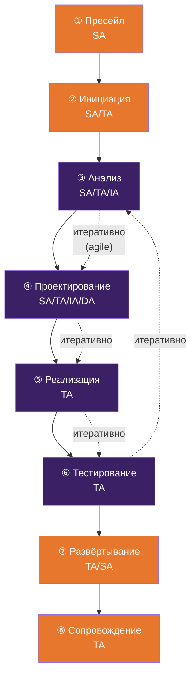

# Архитектурный процесс по фазам проекта

## Источники

Фазовая модель охватывает полный жизненный цикл проекта (Analyze → Design → Build → Test) с поддержкой итеративного подхода, обогащена практиками evolutionary architecture и AI-инструментами.

## Общая карта

В agile-контексте фазы 3-6 итеративны. Архитектура эволюционирует вместе с продуктом (evolutionary architecture). Каждый спринт может включать уточнение архитектуры, ADR фиксируются по мере принятия решений.

---

## Фазы и активности

### 1. Пресейл

**Цель:** оценить техническую реализуемость и сформировать предложение.

**Активности:**
- Анализ текущего ландшафта заказчика (as-is)
- Высокоуровневая архитектура решения (to-be концепт, C4 Level 1)
- Оценка трудоёмкости и рисков
- Определение скоупа архитектурных работ
- Предварительный cost model (FinOps)
- Формирование технической части предложения

**Артефакты:** [Solution Concept](artifacts.md#solution-concept) (C4 Context), техническая часть proposal, оценка

**AI-усиление:**
- Чат-ассистент (LLM) для быстрого анализа RFP/требований и структурирования вариантов
- Генерация черновика C4 Context из текстового описания
- Анализ аналогичных решений и лучших практик

---

### 2. Инициация

**Цель:** детализировать подход и подготовить команду.

**Активности:**
- Уточнение архитектурного скоупа
- Определение архитектурных принципов проекта (первые ADR)
- Планирование архитектурных активностей
- Выбор инструментов и нотаций (Mermaid/Structurizr, docs platform)
- Инициализация starter kit (/architecture/, /decisions/, /quality/)
- Определение AI-политики проекта

**Артефакты:** [Architecture Principles](artifacts.md#architecture-principles) (ADR-0001..N), план архитектурных работ, [AI Policy](artifacts.md#ai-policy), [Starter Kit](artifacts.md#starter-kit) в репозитории

---

### 3. Анализ архитектуры

**Цель:** определить архитектурные требования и сформировать целевую архитектуру.

**Активности:**
- Сбор и приоритизация NFR (расширенный чеклист: + cost, + sustainability)
- Определение принципов и выбор паттернов
- Анализ по 4 измерениям:
  - **Development** - CI/CD, инструменты, стандарты
  - **Runtime** - сервисы, контейнеры, оркестрация
  - **Operations** - мониторинг, alerting, восстановление
  - **Infrastructure** - сети, хранилища, облачные сервисы
- Формирование стандартов и гайдлайнов
- Определение fitness functions (5-15 проверяемых правил)
- Threat modeling (для проектов с требованиями безопасности)
- Подготовка среды разработки

**Артефакты:** Architecture Requirements, [Architecture Blueprints](artifacts.md#архитектурные-блюпринты) (черновые), [Development Standards](artifacts.md#development-standards), [Architecture Principles](artifacts.md#architecture-principles) (ADR), [NFR Checklist](artifacts.md#nfr-checklist), [Fitness Functions](artifacts.md#fitness-functions), [Threat Model](artifacts.md#threat-model)

**AI-усиление:**
- Терминальный AI-агент или AI-ассистент в IDE для reverse engineering существующего кода (если есть legacy)
- Чат-ассистент для генерации NFR чеклиста из описания бизнес-требований
- Инструмент поведенческого анализа кода для первичной оценки техдолга (если работаем с существующей системой)

**Верификация:** Design review перед переходом к проектированию

---

### 4. Проектирование архитектуры

**Цель:** детализировать компоненты и подготовить к реализации.

**Активности:**
- Проектирование компонентов по 4 измерениям (C4 Level 2-3)
- Моделирование производительности (если критично)
- DME для выбора компонентов → ADR
- Проектирование интеграций (OpenAPI/AsyncAPI specs)
- API design с contract-first подходом + линтинг спецификаций
- Обновление архитектурных блюпринтов
- Планирование тестирования архитектуры
- Policy-as-code для инфраструктурных решений (OPA/Conftest)

**Артефакты:** [C4 Container/Component diagrams](artifacts.md#solution-architecture-c4-based), Component Designs, [API Specs](artifacts.md#api-specifications) (OpenAPI/AsyncAPI), [Integration Design](artifacts.md#integration-design), обновлённые [Blueprints](artifacts.md#архитектурные-блюпринты), [ADR](artifacts.md#architecture-decision-records-adr), [Policy Rules](artifacts.md#policy-rules-policy-as-code)

**AI-усиление:**
- Чат-ассистент для генерации OpenAPI specs из описания
- Генерация Mermaid/C4 диаграмм из текстовых решений
- Проверка консистентности решений (trade-off analysis)

**Верификация:** Design review через PR + ARB office hours для критичных решений

---

### 5. Реализация

**Цель:** построить и проверить архитектурные компоненты.

**Активности:**
- Сборка и юнит-тестирование компонентов
- Включение fitness functions в CI/CD pipeline
- Архитектурное ревью кода (соответствие C4, контракты, границы модулей)
- Управление техническим долгом (инструменты анализа качества кода)
- Обновление архитектурной документации по мере изменений

**Артефакты:** рабочие компоненты, результаты ревью, обновлённая документация, CI pipeline с [fitness functions](artifacts.md#fitness-functions)

**AI-усиление:**
- Терминальный AI-агент для code review с архитектурным фокусом
- AI-ассистент в IDE для pair programming на сложных компонентах
- Автоматический анализ соответствия кода архитектурным решениям

---

### 6. Тестирование архитектуры

**Цель:** убедиться, что архитектура работает как спроектировано.

**Активности:**
- Выполнение fitness functions (автоматически в CI)
- Нагрузочное тестирование (performance NFR)
- Тестирование безопасности (threat model verification)
- Тестирование отказоустойчивости (chaos engineering для критичных систем)
- Проверка cost model (FinOps - реальные затраты vs прогноз)
- Проверка drift (IaC vs реальное состояние)

**Артефакты:** результаты [fitness functions](artifacts.md#fitness-functions), отчёты нагрузочного тестирования, security report, [FinOps report](artifacts.md#finops-assessment)

---

### 7. Развёртывание

**Цель:** обеспечить корректную установку решения в целевой среде.

**Активности:**
- Верификация процедур развёртывания
- Проверка работоспособности решения в production
- Проверка наблюдаемости (трассировки, метрики, логи)
- Передача в эксплуатацию (runbooks, Operations Blueprint)
- Обновление каталога сервисов (если используется портал разработчика)

---

### 8. Сопровождение

**Цель:** поддержка и эволюция архитектуры.

**Активности:**
- Мониторинг архитектурных метрик (DORA, SLO, cost)
- Architecture observability: dependency graph + SLO + cost + policy compliance
- Управление техническим долгом (регулярный пересмотр)
- Эволюция архитектуры под новые требования
- Drift detection (IaC) + уведомления
- Обновление fitness functions при изменении требований

**Инструменты:**
- Система сбора телеметрии для runtime-наблюдаемости
- Портал разработчика / каталог сервисов для ownership
- Инструмент анализа качества кода для отслеживания техдолга
- Мониторинг облачных затрат (FinOps)

---

## Интерфейсы с другими ролями

Методика фокусируется на архитектурной работе, но архитектор не работает в вакууме. Ниже -- точки взаимодействия с ключевыми ролями.

| Роль | Что архитектор получает (входы) | Что архитектор отдаёт (выходы) | Формат взаимодействия |
|------|-------------------------------|-------------------------------|----------------------|
| **BA** | Бизнес-требования, user stories, приоритеты | ASR, NFR targets, constraints, trade-offs | Совместные workshops, requirements review |
| **PM** | Scope, timeline, бюджет | Архитектурные риски, effort estimates, gates | Planning, status updates, gate reviews |
| **QA** | Тест-результаты, баг-репорты | NFR targets, test scenarios из архитектуры | NFR review, test strategy alignment |
| **DevOps / SRE** | CI/CD capabilities, infra state, инциденты | Fitness functions, IaC policies, deployment model | CI setup, platform requirements, SLO review |
| **Security** | Threat intelligence, compliance requirements | Threat model, security architecture | Security review, compliance mapping |

**Принципы:**
- Архитектор не заменяет эти роли, а создаёт артефакты, которые они используют
- NFR targets согласуются совместно с QA и бизнесом (не архитектор в одиночку)
- Fitness functions определяет архитектор, реализуют DevOps/SRE
- Threat model -- совместная работа архитектора и security

---

## Масштабирование по типу проекта

| Тип проекта | Какие фазы | Глубина |
|-------------|-----------|---------|
| Аудит | ①+③ (анализ as-is) | [C4 L1](artifacts.md#c4-context-diagram-level-1), [NFR assessment](artifacts.md#nfr-checklist), tech debt report |
| Экспресс-оценка | ① | [Solution Concept](artifacts.md#solution-concept), high-level estimate |
| Средний проект | ①-⑦ | [C4 L1-L2](artifacts.md#solution-architecture-c4-based), [ADR](artifacts.md#architecture-decision-records-adr), [NFR](artifacts.md#nfr-checklist), основные [blueprints](artifacts.md#архитектурные-блюпринты) |
| Трансформация | ①-⑧, все фазы полностью | Полный набор артефактов, [fitness functions](artifacts.md#fitness-functions), [policy-as-code](artifacts.md#policy-rules-policy-as-code) |
| Continuous | ⑤-⑧ в цикле | Evolutionary architecture, [fitness functions](artifacts.md#fitness-functions), observability |
