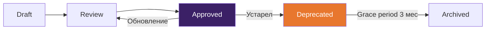

# Дорожная карта внедрения методики

## Три горизонта

Логика: сначала стандартизируем минимально-полезные артефакты и процесс, затем автоматизируем и "подключаем" архитектуру к delivery-данным.

---

## Горизонт 1: Внедрять сразу

**Цель:** единый baseline для всех проектов. Архитектор получает рабочий набор инструментов.

### "Лёгкая архитектура решения" как стандарт

Каждый проект начинается с:
- C4 Context + Container (Mermaid) - 2 обязательных диаграммы
- ADR log в Git - фиксация всех значимых решений
- NFR Checklist - систематический сбор требований (включая cost и sustainability)
- Starter Kit в репозитории (/architecture/, /decisions/, /quality/)

**Критерий перехода:** 3+ проекта используют starter kit без существенных проблем.

### AI-политика и командный prompt kit

- Зафиксировать правила: где AI разрешён, где запрещён
- Создать prompt kit для архитекторов (анализ требований, черновики ADR, диаграммы, ревью)
- AGENTS.md / CLAUDE.md шаблон для архитектурных проектов
- Обучение команды (workshop 2-3 часа)

**Критерий перехода:** 80% архитекторов используют prompt kit в работе.

### Lightweight ARB

- Timeboxed формат: 60-90 мин/неделю office hours
- Асинхронные ревью через PR в Git
- Чеклисты по pillars (reliability, security, cost, performance)
- Well-Architected review как формат для аудитов

**Критерий перехода:** ARB работает 2+ месяца, не блокирует delivery, собирает полезную обратную связь.

### Architecture Community of Practice (Guild)

- Запуск регулярных встреч (раз в 2 недели)
- Первые поставки: шаблоны C4, ADR, NFR checklist
- Lessons learned с текущих проектов

---

## Горизонт 2: Внедрять в горизонте полугода

**Цель:** автоматизация governance и масштабирование на всю практику.

### Fitness functions в CI

- 5-10 стандартных checks: линтинг API-спецификаций, IaC policy (OPA/Conftest), security rules
- Стандартные fitness functions как часть starter kit
- Обучение TA по написанию кастомных checks

**Зависимость:** Горизонт 1 (starter kit стабилизирован, команда понимает концепцию).

### Docs-as-code в масштабе практики

- Единая документация практики на MkDocs/Docusaurus
- Referencing architectures и golden paths
- Backstage TechDocs как целевой вариант (если масштаб оправдывает)

### Управление техдолгом как процесс

- Инструменты анализа кода интегрированы в архитектурные ревью
- Техдолг как категория рисков в аудитах
- Связь с DORA-метриками

### Contract-first API governance

- OpenAPI/AsyncAPI как обязательный артефакт для API
- Набор правил линтера API (style guide) как стандарт практики
- CI linting для всех API-проектов

### Пилот EAM-платформы (если фокус на EA)

- Выбрать 1-2 показательных кейса (портфель + capability + roadmap)
- Пилот на LeanIX / Ardoq / HOPEX (зависит от профиля клиента)
- Доказать value перед масштабированием

### FinOps & Cloud Cost Management

- FinOps Assessment как обязательный артефакт на L2+
- Unit economics и cost SLO как часть архитектурного процесса
- Tagging strategy, cost anomaly detection
- Методика, шаблоны и чеклисты готовы — см. [практику FinOps](practices.md#14-finops--cloud-cost-management)

### Green Architecture & Sustainability

- SCI (Software Carbon Intensity, ISO/IEC 21031:2024) как архитектурная метрика
- Carbon-aware patterns: demand shifting, demand shaping, proximity
- Sustainability как категория NFR и pillar в architecture review
- Методика готова — см. [практику Green Architecture](practices.md#13-green-architecture--sustainability)
- Актуально для проектов с ESG-отчётностью и крупных enterprise-заказчиков

### Platform Engineering / IDP

- Backstage как developer portal + Software Catalog
- Golden paths, self-service capabilities, DevEx-метрики
- CNCF Platform Engineering Maturity Model как ориентир
- Методика, плейбук и шаблон assessment готовы — см. [практику Platform Engineering](practices.md#16-platform-engineering--idp)
- Имеет смысл при масштабе 50+ разработчиков на проектах

---

## Горизонт 3: Отслеживать и готовить к пилотам

**Цель:** следить за emerging-практиками, пилотировать перспективные.

### MCP-экосистема и "подключённые архитектурные ассистенты"

- Model Context Protocol для подключения AI к корпоративным данным
- Архитектурные аудиты с AI-агентами, подключёнными к репозиториям и документации
- Требует зрелого контроля доступа

### AI-агенты в EAM

- Вендоры наращивают AI-слой (Ardoq AI Agents и др.)
- Практическая ценность зависит от качества данных в EA-модели
- Мониторим, пилотируем когда будет зрелый EAM-процесс

---

## Операционная модель методики

Методика — это продукт. Продукт без владельца деградирует.

### Ownership

| Роль | Ответственность |
|------|----------------|
| **Product Owner методики** | Приоритизация backlog, release decisions, метрики adoption |
| **Maintainers** (2–3 Senior Architects) | Review PR, актуализация шаблонов, CI/quality |
| **Contributors** (все архитекторы) | Предложения улучшений, lessons learned, примеры с проектов |

### Release Cadence

- **Ежемесячный review**: maintainers проверяют актуальность, закрывают issues
- **Квартальный релиз**: обновление версии методики, changelog, коммуникация изменений
- **Ad-hoc**: hotfix при обнаружении критичных проблем (битые ссылки, устаревшие рекомендации)
- Версионирование: semver (`v1.0.0`, `v1.1.0`, `v2.0.0` для breaking changes)

### Правила качества

- **Нет ссылки без файла**: каждая ссылка на `../templates/*.md` должна вести на существующий файл
- **Нет артефакта без шаблона**: если артефакт описан в `artifacts.md`, для него есть шаблон в `../templates/`
- **Нет практики без примера**: каждая практика иллюстрирована конкретным сценарием
- Эти правила проверяются автоматически в CI (markdown-link-check, custom scripts)

### Onboarding нового архитектора

1. Прочитать [Core Standard](core-standard.md) — 15 минут, «что обязательно»
2. Определить свой [Playbook](playbooks.md) — 10 минут, «что делать на моём типе проекта»
3. Инициализировать [Starter Kit](artifacts.md#starter-kit) — 15 минут, «начать работу»
4. Записаться на ближайшие [Office Hours](governance-charter.md#office-hours-проектный-review) — задать вопросы
5. Присоединиться к [Guild](practices.md#18-architecture-community-of-practice) — быть в курсе

Целевое время от «получил доступ» до «первый артефакт готов»: **< 1 час**.

### Architecture Practice Maturity Model

| Уровень | Название | Характеристики | Метрики перехода |
|---------|---------|---------------|-----------------|
| **1** | Ad Hoc | Нет стандартов, каждый работает по-своему | — |
| **2** | Standardized | Core Standard внедрён, starter kit используется, ADR ведутся | ≥50% проектов со starter kit, ≥3 ADR на проект |
| **3** | Automated | CI gates, fitness functions, API lint, policy-as-code | ≥70% проектов с CI gates, DORA метрики измеряются |
| **4** | Optimizing | Метрики эффекта, continuous improvement, architecture observability | Снижение rework ≥20%, conformance ≥90%, Guild работает |

Текущий целевой уровень: **2 → 3** (стандартизация → автоматизация).

### Метрики эффекта (effect metrics)

Помимо adoption-метрик (сколько проектов используют), важны метрики **эффекта**:

| Метрика | Что измеряет | Источник | Target |
|---------|-------------|---------|--------|
| Architecture conformance | % проектов, соответствующих Core Standard | Quarterly review | ≥80% |
| Deployment rework rate | % деплоев с hotfix/rollback | CI/CD metrics | Тренд на снижение |
| Architecture review defects | Кол-во проблем, найденных на review vs в проде | Review logs, incidents | Ratio ≥ 3:1 |
| Onboarding time | Время от старта до первого артефакта | Survey | < 1 час |
| Tech debt age | Средний возраст элементов в debt register | Tech Debt Register | < 90 дней |
| Decision velocity | Среднее время принятия решения (по SLA) | ADR timestamps | В рамках SLA |

---

## Сертификационная дорожная карта

Параллельно с внедрением методики:

| Период | Фокус |
|--------|-------|
| Первые 3 месяца | Cloud certifications (AWS SA Pro / Azure SA Expert) для ключевых архитекторов |
| 3–6 месяцев | iSAQB CPSA Foundation для Middle+ архитекторов |
| 6–9 месяцев | FinOps Practitioner для SA, работающих на облачных проектах |
| 9–12 месяцев | Специализированные (CKA, TOGAF) по потребности проектов |

---

## Knowledge Management Governance

Методика как knowledge base требует governance — без него контент деградирует, устаревает и становится ненадёжным.

### Таксономия контента

Каждый документ в базе знаний принадлежит к одному из типов:

| Тип | Назначение | Аудитория | Lifecycle | Пример |
|-----|-----------|----------|-----------|--------|
| **standard** | Обязательные нормы и правила | Все архитекторы | Длинный (пересмотр раз в 6 мес) | Core Standard, Governance Charter |
| **practice** | Описание подхода, методики, рекомендации | Все архитекторы | Длинный (пересмотр раз в 6 мес) | Practices §1–18 |
| **template** | Шаблон артефакта для заполнения на проекте | Архитекторы на проектах | Средний (обновление по feedback) | ADR Template, Cost Model |
| **playbook** | Пошаговая инструкция для типа engagement | Архитекторы на проектах | Средний (обновление по feedback) | Audit Playbook, Platform Playbook |
| **example** | Заполненный пример для обучения | Новые архитекторы, обучение | Средний | ADR Example, C4 Examples |
| **reference** | Справочная информация, исследования | Все | Короткий (может устареть быстро) | Research Result, Gap Analysis |

**Tagging system:**

| Категория тегов | Примеры | Назначение |
|----------------|---------|-----------|
| **domain** | `security`, `data`, `integration`, `platform`, `finops` | Фильтрация по предметной области |
| **phase** | `analysis`, `design`, `implementation`, `operations` | Привязка к фазе процесса |
| **rigor** | `L0`, `L1`, `L2`, `L3` | Минимальный уровень, на котором применимо |
| **role** | `solution-architect`, `technical-architect`, `integration-architect` | Целевая роль |

### Metadata Standard

Каждый документ должен содержать metadata-блок (frontmatter или заголовочную таблицу):

```yaml
# Пример frontmatter для markdown-документа
---
title: "Core Standard"
type: standard              # standard | practice | template | playbook | example | reference
status: approved            # draft | review | approved | deprecated | archived
owner: "Architecture Guild"
last-reviewed: 2026-01-15
review-cycle: 6 months
tags: [governance, core, L0, L1, L2, L3]
---
```

**Статусы жизненного цикла:**



| Статус | Описание | Кто может использовать |
|--------|---------|----------------------|
| **draft** | Черновик, в работе | Автор, reviewers |
| **review** | На ревью у maintainers | Можно ссылаться с пометкой «draft» |
| **approved** | Одобрен, актуален | Все |
| **deprecated** | Устарел, будет архивирован | С предупреждением, ссылка на замену |
| **archived** | Удалён из активной навигации | Доступен в Git-истории |

### Research Freshness

Утверждения о статусе инструментов, стандартов и проектов (CNCF graduated/incubation, версии фреймворков и т.п.) устаревают быстро.

**Правила:**
- Фактические утверждения проверяются раз в **6 месяцев** по официальному источнику (сайт проекта, CNCF Landscape, документация вендора)
- При внедрении frontmatter каждый документ типа `reference` получает поле `last-verified: YYYY-MM-DD`
- CI-проверка (target): warning при `last-verified` > 6 месяцев

### Review & Deprecation Process

**Периодический review:**
- Каждый документ пересматривается раз в **6 месяцев** (standards, practices) или **3 месяца** (reference)
- Maintainer проверяет: актуальность, ссылки, соответствие текущим практикам
- Результат: обновление `last-reviewed` или переход в `deprecated`

**Критерии deprecation:**
- Содержание заменено другим документом (указать ссылку на замену)
- Практика больше не актуальна (изменились подходы в индустрии)
- Документ не использовался на проектах более 12 месяцев

**Процесс deprecation:**
1. Maintainer помечает документ `status: deprecated` с указанием причины и замены
2. Grace period: **3 месяца** (документ доступен, но с предупреждением)
3. После grace period: `status: archived`, удаление из навигации
4. Документ остаётся в Git-истории (не удаляется физически)

**CI-проверка (target):**
- Warning при `last-reviewed` > 6 месяцев назад
- Error при `last-reviewed` > 12 месяцев назад
- Warning при ссылках на `deprecated` документы

### Versioning Strategy

**Версионирование методики:**
- Формат: semver (`v1.0.0`)
- **Patch** (v1.0.x): исправления ошибок, битые ссылки, опечатки
- **Minor** (v1.x.0): новые шаблоны, расширение практик, новые примеры
- **Major** (vX.0.0): breaking changes — изменение Core Standard, удаление обязательных артефактов, изменение уровней rigor

**Changelog:**
- Ведётся в `CHANGELOG.md` (или в releases Git)
- Каждый квартальный релиз — entry с категориями: Added, Changed, Deprecated, Removed
- Breaking changes выделяются явно с migration guide

### Multi-team Contribution Model

**Роли:**

| Роль | Кто | Права | Ответственность |
|------|-----|-------|----------------|
| **Product Owner** | Head of Architecture | Merge, Release | Приоритизация, roadmap, release decisions |
| **Maintainers** | 2–3 Senior Architects | Merge, Review | Quality control, review PR, актуализация |
| **Contributors** | Все архитекторы | PR | Предложения, lessons learned, примеры |
| **Reviewers** | Maintainers + domain experts | Approve | Review PR в своей области |

**PR-based workflow:**
1. Contributor создаёт branch и PR с описанием изменения
2. PR проходит CI (markdown lint, link check, metadata validation)
3. ≥1 Maintainer (или domain expert) делает review
4. После approve — merge в main
5. Квартальный release с changelog

**Template для предложения нового контента:**

```markdown
## Предложение: [Название]

**Тип контента:** [standard / practice / template / playbook / example]
**Обоснование:** [Почему это нужно, какую проблему решает]
**Целевая аудитория:** [Кто будет использовать]
**Зависимости:** [Какие существующие документы затрагивает]
**Объём работы:** [Оценка в часах / днях]
**Автор:** [Кто готов написать]
```

### Discoverability & Getting Started

**Getting Started paths по ролям:**

| Роль | Path | Время |
|------|------|:-----:|
| **Новый архитектор** | Core Standard → Playbook по типу проекта → Starter Kit → Office Hours → Guild | < 1 час |
| **Тимлид / Tech Lead** | Core Standard → Practices (ADR, NFR) → Quality Gates → Шаблоны | < 30 мин |
| **Менеджер проекта** | Обзор → Core Standard (уровни rigor) → Артефакты (deliverables) → Playbooks | < 20 мин |
| **Новый сотрудник** | Обзор → Roles → Getting Started → первый артефакт с ментором | < 2 часа |

**Навигация по предметным областям:**

| Область | Ключевые разделы |
|---------|-----------------|
| Security | Practices §15, Threat Model, Quality Gates (security), 152-ФЗ/187-ФЗ mapping |
| Data | Practices §11–12, Data Contract, EDA Decision Record |
| Integration | Practices §10, §12, Integration Design, API Specification |
| Platform | Practices §16, Platform Assessment, Playbook Platform Engineering |
| Cost & Sustainability | Practices §13–14, Cost Model, FinOps Assessment, NFR Checklist |
| AI | Practices §9, §17, AI Policy, AI Prompts |

---

## Метрики успеха

Как понять, что методика работает:

| Метрика | Цель через 6 мес | Цель через 12 мес |
|---------|-------------------|---------------------|
| Проекты со starter kit | 50% новых проектов | 80% |
| ADR на проекте | Хотя бы 3 ADR | 5+ ADR, decision log актуален |
| Время onboarding архитектора | - | Сокращение на 30% |
| Architecture review coverage | 30% проектов | 70% проектов |
| AI adoption среди архитекторов | 50% используют prompt kit | 80%, есть кастомные промпты |
| Guild attendance | 40% архитекторов | 60% |
