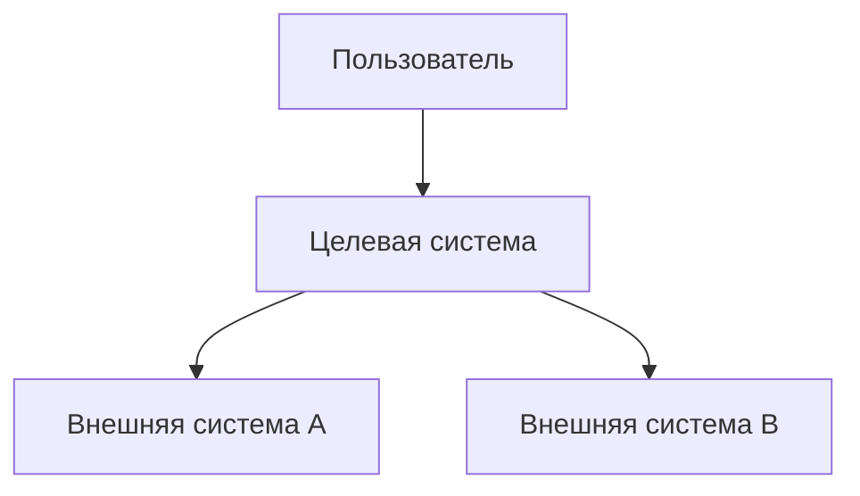
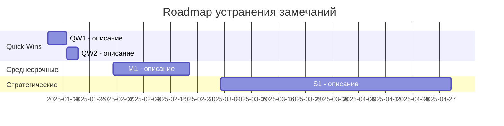

# Architecture Assessment Report

> Шаблон отчёта по архитектурному аудиту / assessment. Заполняется [Solution Architect](../docs/roles.md#solution-architect) по результатам обследования.

## 1. Резюме для руководства

| Параметр | Значение |
|----------|---------|
| **Заказчик** | [Название организации] |
| **Система / ландшафт** | [Название системы или периметр обследования] |
| **Период обследования** | [Даты] |
| **Архитектор** | [Имя, роль] |
| **Уровень rigor** | L0 / L1 (см. [Core Standard](../docs/core-standard.md)) |

### Общая оценка

[1–2 абзаца: состояние архитектуры, ключевые выводы, critical findings]

### Топ-3 риска

1. [Краткое описание + критичность]
2. [Краткое описание + критичность]
3. [Краткое описание + критичность]

### Топ-3 quick wins

1. [Что сделать + ожидаемый эффект + оценка трудоёмкости]
2. [Что сделать + ожидаемый эффект + оценка трудоёмкости]
3. [Что сделать + ожидаемый эффект + оценка трудоёмкости]

---

## 2. Scope и подход

### Периметр обследования

- [Системы / компоненты, попавшие в scope]
- [Что явно не входит в scope]

### Методы обследования

- [ ] Интервью со стейкхолдерами
- [ ] Анализ документации
- [ ] Reverse engineering кода / инфраструктуры
- [ ] Анализ метрик (DORA, SLO, cost)
- [ ] Threat modeling
- [ ] Другое: [описание]

### Стейкхолдеры

| Роль | Имя | Что обсуждали |
|------|-----|---------------|
| Product Owner | | |
| Tech Lead | | |
| DevOps Engineer | | |
| Security | | |

---

## 3. As-Is архитектура

### C4 Context (Level 1)

### Ключевые компоненты

| Компонент | Технология | Версия | Назначение | Состояние |
|-----------|-----------|--------|-----------|-----------|
| Frontend | React | 18.x | SPA | ⚠️ Устаревшие зависимости |
| API | Java/Spring | 3.x | REST API | ✅ Актуально |
| Database | PostgreSQL | 14 | Основное хранилище | ✅ |
| Message Broker | RabbitMQ | 3.12 | Async messaging | ⚠️ Нет кластера |

### Инфраструктура

[Описание: облако/on-prem, оркестрация, CI/CD, мониторинг]

---

## 4. NFR Gap Analysis

| Категория | Текущее состояние | Target / Best practice | Gap | Критичность |
|-----------|------------------|----------------------|-----|-------------|
| **Availability** | ~99.5% (нет SLO) | 99.9% с определёнными SLO | Нет формальных SLO, нет failover | 🔴 High |
| **Performance** | p99 ~800ms | p99 < 300ms | Нет оптимизации запросов, нет кэша | 🟡 Medium |
| **Security** | Basic auth | Zero Trust, MFA, encryption at rest | Нет шифрования at rest, нет audit trail | 🔴 High |
| **Scalability** | Single instance | Horizontal scaling | Нет autoscaling, stateful sessions | 🟡 Medium |
| **Observability** | Логи в файлы | OpenTelemetry, structured logging | Нет трассировки, нет метрик | 🟡 Medium |
| **Cost** | Не измеряется | FinOps, cost per transaction | Нет cost visibility | 🟢 Low |
| **Maintainability** | Code coverage 20% | Coverage > 60%, complexity limits | Низкое покрытие, высокая связность | 🟡 Medium |

---

## 5. Архитектурные риски

| # | Риск | Вероятность | Импакт | Критичность | Mitigation |
|---|------|-----------|--------|-------------|-----------|
| R1 | [Описание] | High | High | 🔴 Critical | [Рекомендация] |
| R2 | [Описание] | Medium | High | 🟡 High | [Рекомендация] |
| R3 | [Описание] | Medium | Medium | 🟡 Medium | [Рекомендация] |
| R4 | [Описание] | Low | Medium | 🟢 Low | [Рекомендация] |

---

## 6. Технический долг

| # | Элемент долга | Категория | Стоимость устранения | Риск при неустранении | Приоритет |
|---|-------------|-----------|---------------------|---------------------|-----------|
| TD1 | [Описание] | Security | [человеко-дни] | [Что произойдёт] | 🔴 P1 |
| TD2 | [Описание] | Scalability | [человеко-дни] | [Что произойдёт] | 🟡 P2 |
| TD3 | [Описание] | Maintainability | [человеко-дни] | [Что произойдёт] | 🟡 P2 |

Категории: Security, Scalability, Performance, Maintainability, Reliability, Cost, Compliance.

---

## 7. Рекомендации

### Quick Wins (0–1 месяц)

| # | Рекомендация | Эффект | Трудоёмкость | Связанные риски |
|---|-------------|--------|-------------|----------------|
| QW1 | [Конкретное действие] | [Измеримый результат] | [дни] | R1, TD1 |
| QW2 | [Конкретное действие] | [Измеримый результат] | [дни] | R2 |

### Среднесрочные (1–3 месяца)

| # | Рекомендация | Эффект | Трудоёмкость | Связанные риски |
|---|-------------|--------|-------------|----------------|
| M1 | [Конкретное действие] | [Измеримый результат] | [недели] | R2, R3 |

### Стратегические (3–6 месяцев)

| # | Рекомендация | Эффект | Трудоёмкость | Связанные риски |
|---|-------------|--------|-------------|----------------|
| S1 | [Конкретное действие] | [Измеримый результат] | [месяцы] | R1, TD2, TD3 |

---

## 8. Roadmap рекомендаций

---

## Приложения

### A. Список интервью

| Дата | Участники | Тема | Ключевые выводы |
|------|----------|------|----------------|
| | | | |

### B. Документы, использованные при анализе

- [Список документации, которую изучали]

### C. Глоссарий

| Термин | Определение |
|--------|-----------|
| | |
