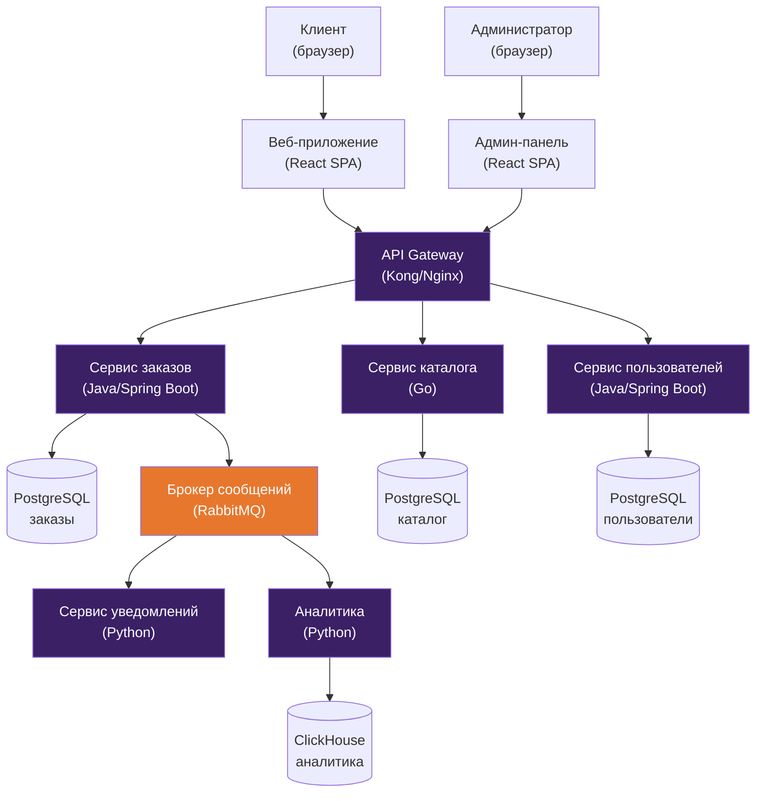

# C4 Container Diagram: [Название системы]

> Пример. Показывает основные технические блоки системы.

## Описание контейнеров

| Контейнер | Технология | Назначение |
|-----------|-----------|------------|
| Веб-приложение | React SPA | Интерфейс клиента |
| Админ-панель | React SPA | Управление каталогом и заказами |
| API Gateway | Kong/Nginx | Маршрутизация, rate limiting, аутентификация |
| Сервис заказов | Java/Spring Boot | Бизнес-логика заказов |
| Сервис каталога | Go | CRUD каталога, поиск |
| Сервис пользователей | Java/Spring Boot | Регистрация, профили, авторизация |
| Сервис уведомлений | Python | Отправка SMS/email по событиям |
| Аналитика | Python | Обработка и агрегация событий |
| Брокер сообщений | RabbitMQ | Асинхронное взаимодействие между сервисами |
