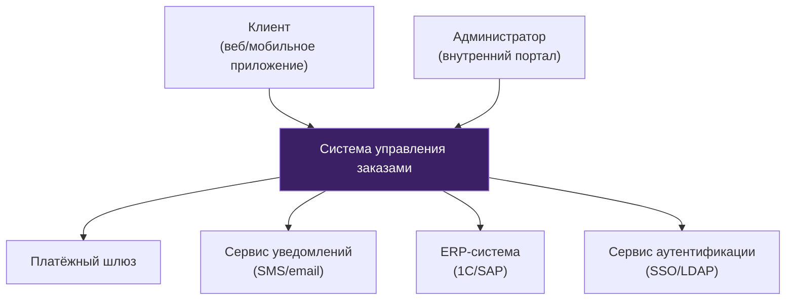

# C4 Context Diagram: [Название системы]

> Пример. Показывает систему в окружении пользователей и внешних систем.

## Описание контекста

| Элемент | Описание |
|---------|----------|
| Клиент | Конечный пользователь, оформляет и отслеживает заказы |
| Администратор | Внутренний сотрудник, управляет каталогом и заказами |
| Платёжный шлюз | Внешний сервис приёма платежей |
| Сервис уведомлений | Рассылка SMS и email по событиям заказа |
| ERP-система | Синхронизация остатков, цен, отгрузок |
| Сервис аутентификации | Корпоративный SSO для администраторов |
