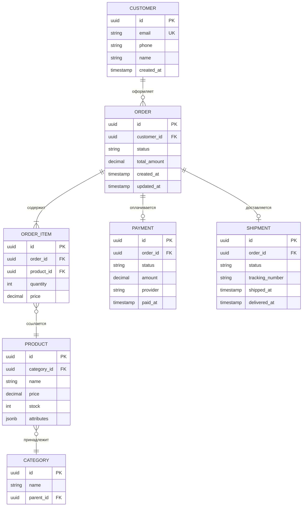

# Data Model: [Название проекта]

> Пример модели данных. Адаптируйте под ваш проект.

## ER-диаграмма (основные сущности)

## Ключевые решения

| Решение | Обоснование |
|---------|-------------|
| UUID для PK | Генерация на стороне приложения, безопасность при интеграции |
| JSONB для атрибутов товара | Гибкая схема для разных категорий без EAV |
| Decimal для денежных сумм | Точность финансовых вычислений |
| Soft delete (status) | Сохранение истории для аналитики |

## Индексы

| Таблица | Индекс | Тип | Назначение |
|---------|--------|-----|------------|
| orders | (customer_id, created_at DESC) | btree | Список заказов клиента |
| orders | (status) | btree | Фильтрация по статусу |
| products | (category_id) | btree | Каталог по категориям |
| products | (attributes) | gin | Поиск по атрибутам |
