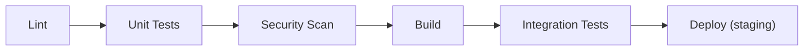

# Development Standards: [Название проекта]

> Пример стандартов разработки. Адаптируйте под ваш проект.

## Branching Strategy

**Модель:** GitLab Flow (feature branches → main → production)

```
main ──────────────────────────── production
  ├── feature/ORDER-123-cart ──┘
  ├── feature/ORDER-456-payment
  └── fix/ORDER-789-timeout
```

- Feature-ветки от `main`, именование: `feature/TASK-ID-description`
- Фикс-ветки: `fix/TASK-ID-description`
- Merge только через merge request с обязательным code review

## Code Review

### Чеклист для ревьюера

- [ ] Код соответствует архитектурным решениям (ADR)
- [ ] Нет нарушений границ модулей (dependency rules)
- [ ] API изменения обратно совместимы (или есть ADR на breaking change)
- [ ] Тесты покрывают новую функциональность
- [ ] Нет хардкода секретов, URL, конфигурации
- [ ] Логирование достаточное (но не избыточное)
- [ ] Нет TODO без привязки к задаче

### Правила

- Минимум 1 approve для merge
- Архитектурные изменения (новые сервисы, интеграции, изменения контрактов) — 2 approves, один от архитектора
- Автоматические проверки (lint, tests, security scan) должны пройти

## Code Style

| Язык | Линтер | Форматтер | Конфигурация |
|------|--------|-----------|-------------|
| Java | Checkstyle | google-java-format | `.checkstyle.xml` |
| Go | golangci-lint | gofmt | `.golangci.yml` |
| TypeScript | ESLint | Prettier | `.eslintrc.js`, `.prettierrc` |
| Python | Ruff | Black | `pyproject.toml` |

## Коммиты

Формат: [Conventional Commits](https://www.conventionalcommits.org/)

```
feat(orders): добавить отмену заказа
fix(catalog): исправить фильтрацию по цене
docs(arch): обновить C4 container diagram
chore(ci): добавить проверку лицензий зависимостей
```

## CI Pipeline



Все шаги обязательны. Pipeline блокирует merge при ошибках.
