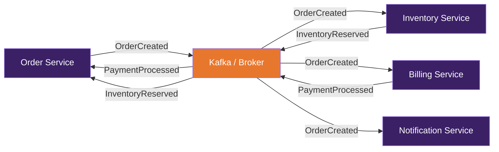

# EDA Decision Record

> Шаблон ADR для решений по Event-Driven Architecture. Расширяет стандартный [ADR](adr-template.md) специфичными для EDA секциями.

---

## ADR-NNNN: [Заголовок решения по EDA]

**Дата:** YYYY-MM-DD
**Статус:** proposed | accepted | deprecated | superseded by ADR-XXXX
**Роль:** [Integration Architect](../docs/roles.md#integration-architect)

### Контекст

[Почему нужно event-driven взаимодействие. Какие сервисы/домены участвуют. Какие требования: latency, throughput, ordering, exactly-once.]

**Текущее состояние:**
- [Как взаимодействие работает сейчас (если есть)]
- [Проблемы текущего подхода]

**Требования:**
- Throughput: [events/sec]
- Latency: [max допустимая задержка]
- Ordering: [нужен ли порядок, в каком scope]
- Delivery guarantee: [at-least-once / exactly-once]
- Retention: [сколько хранить события]

### Рассмотренные паттерны

#### Вариант A: [Pub/Sub]

- **Описание:** [Как будет работать]
- **Плюсы:** простота, loose coupling, масштабируемость
- **Минусы:** [eventual consistency, нет гарантии порядка]
- **Стек:** [Kafka / RabbitMQ / SNS+SQS]

#### Вариант B: [Event Sourcing + CQRS]

- **Описание:** [Как будет работать]
- **Плюсы:** полная история, аудит, temporal queries
- **Минусы:** сложность, learning curve, eventual consistency в read model
- **Стек:** [Kafka / EventStoreDB + отдельный read store]

#### Вариант C: [Saga Orchestration]

- **Описание:** [Как будет работать]
- **Плюсы:** централизованная логика, проще отслеживать состояние
- **Минусы:** orchestrator = single point of failure, coupling
- **Стек:** [Temporal / AWS Step Functions / custom]

### Решение

Выбран **[Вариант X]**, потому что:
- [Обоснование 1]
- [Обоснование 2]
- [Обоснование 3]

### Event Design

#### События

| Тип события | Producer | Consumer(s) | Формат | CloudEvents type |
|------------|---------|-------------|--------|-----------------|
| OrderCreated | Order Service | Inventory, Billing, Notification | JSON (Avro) | `com.example.orders.order.created` |
| PaymentProcessed | Billing Service | Order Service, Notification | JSON (Avro) | `com.example.billing.payment.processed` |
| InventoryReserved | Inventory Service | Order Service | JSON (Avro) | `com.example.inventory.stock.reserved` |

#### Пример события (CloudEvents)

```json
{
  "specversion": "1.0",
  "type": "com.example.orders.order.created",
  "source": "/orders/service",
  "id": "A234-1234-1234",
  "time": "2025-03-15T10:30:00Z",
  "datacontenttype": "application/json",
  "data": {
    "orderId": "ORD-12345",
    "customerId": "CUST-67890",
    "items": [
      { "sku": "PROD-001", "quantity": 2, "price": 1500.00 }
    ],
    "total": 3000.00,
    "currency": "RUB"
  }
}
```

#### Топология



### Инфраструктура

| Компонент | Технология | Обоснование |
|-----------|-----------|-------------|
| Message Broker | [Kafka / RabbitMQ / ...] | [Почему выбрали] |
| Schema Registry | [Confluent / Apicurio / ...] | [Почему] |
| Serialization | [Avro / Protobuf / JSON] | [Почему] |
| Dead Letter Queue | [Kafka DLQ / SQS / ...] | Обработка failed events |

### Error Handling

| Сценарий | Стратегия | Retry | DLQ |
|----------|----------|:---:|:---:|
| Consumer unavailable | Retry with backoff | 3 attempts, exp backoff | ✅ |
| Invalid event schema | Reject, log, alert | — | ✅ |
| Business logic failure | Compensating event | — | ✅ |
| Broker unavailable | Outbox pattern, retry producer | ∞ (with backoff) | — |

### Последствия

**Положительные:**
- [Что улучшится]

**Отрицательные / риски:**
- [Eventual consistency — потребители видят данные с задержкой]
- [Усложняется debugging — нужна distributed tracing]
- [Ordering — [как обеспечивается / не обеспечивается]]

**Мониторинг:**
- Consumer lag (events behind) — алерт при > [threshold]
- Event delivery latency — SLO: p99 < [target]
- DLQ size — алерт при > 0
- Schema compatibility check — CI gate

### Связанные решения

- ADR-XXXX: [Связанное решение]
- [Data Contract](data-contract.md): schema событий
- [Integration Design](integration-design.md): общий design интеграций
- [API Specification (AsyncAPI)](api-specification.md): контракты событий
