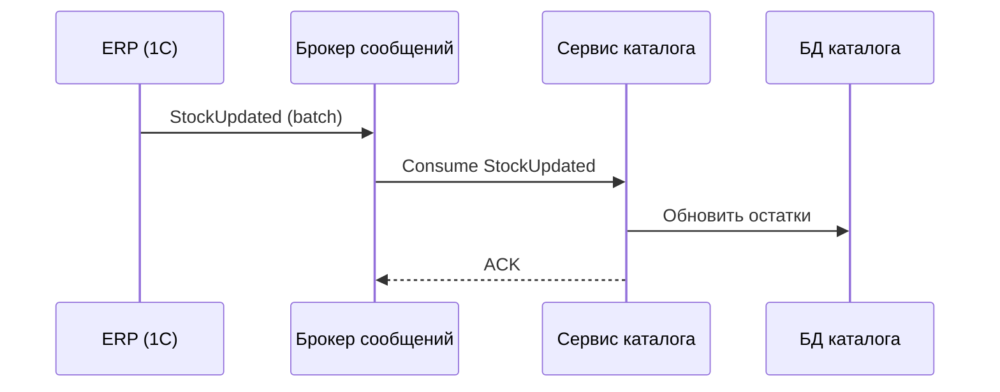
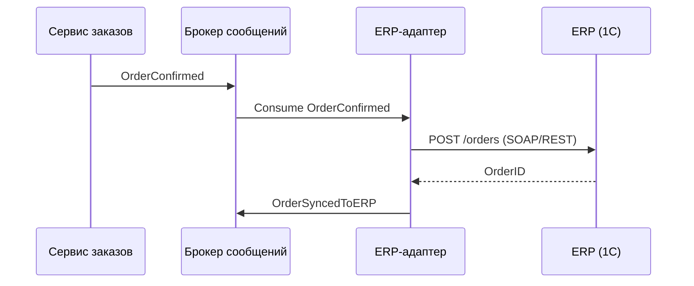
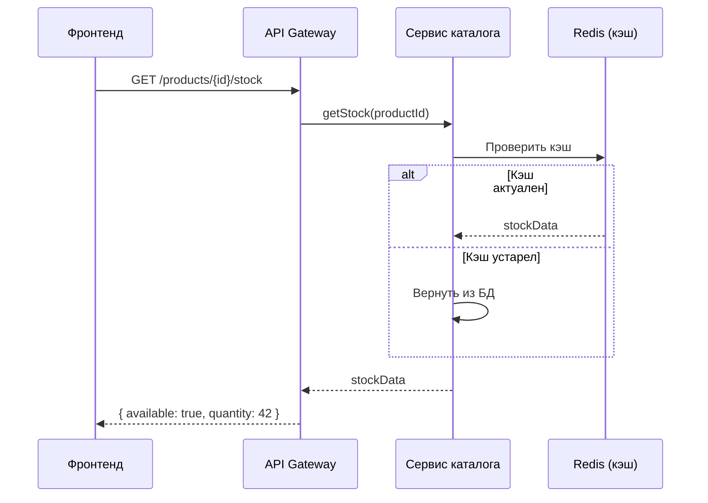

# Integration Design: [Название интеграции]

> Пример описания интеграции. Адаптируйте под ваш проект.

## Обзор

**Системы:** Система управления заказами ↔ ERP (1С)
**Направление:** двустороннее
**Паттерн:** асинхронный (event-driven) + синхронный (запрос остатков)

## Потоки данных

### Поток 1: Синхронизация остатков (ERP → Заказы)

**Паттерн:** Async (batch)
**Триггер:** Изменение остатков в ERP (каждые 15 мин)

### Поток 2: Создание заказа (Заказы → ERP)

**Паттерн:** Async (event)
**Триггер:** Подтверждение заказа клиентом

### Поток 3: Проверка остатков в реальном времени

**Паттерн:** Sync (request-response)
**Триггер:** Добавление товара в корзину

## Контракты

| Поток | Формат | Спецификация |
|-------|--------|-------------|
| StockUpdated | JSON (AsyncAPI) | `api/events/stock-updated.yaml` |
| OrderConfirmed | JSON (AsyncAPI) | `api/events/order-confirmed.yaml` |
| GET /products/{id}/stock | JSON (OpenAPI) | `api/openapi.yaml#/products/{id}/stock` |

## Error Handling

| Сценарий | Стратегия | Retry | DLQ |
|----------|----------|-------|-----|
| ERP недоступна | Retry с exponential backoff | 3 попытки, макс 5 мин | Да |
| Невалидные данные из ERP | Логирование + алерт | Нет | Да |
| Timeout синхронного запроса | Fallback на кэш | — | — |

## SLA интеграции

| Метрика | Целевое значение |
|---------|-----------------|
| Задержка синхронизации остатков | < 15 мин |
| Доставка события OrderConfirmed | < 30 сек |
| Латентность проверки остатков (sync) | < 100 мс |
