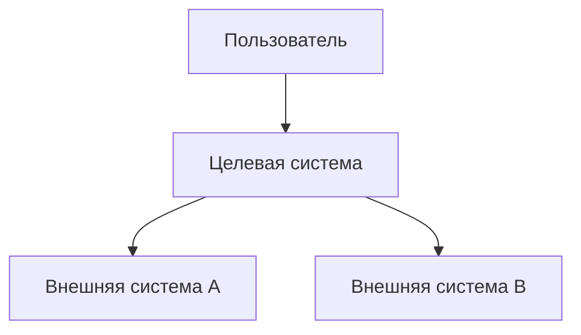
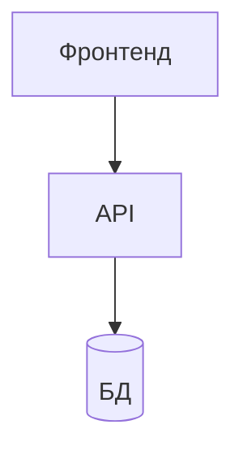
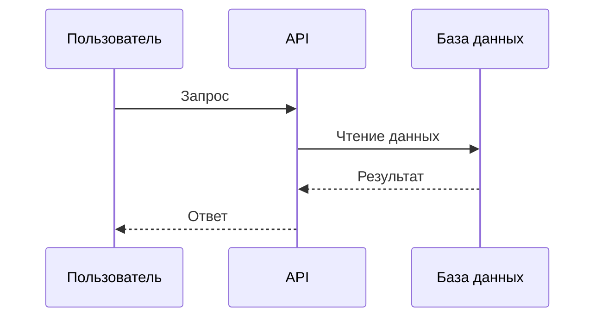
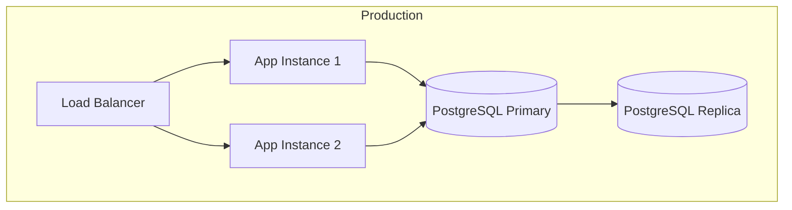

# Solution Architecture: [Название проекта]

> Шаблон на базе arc42. Замените содержимое на актуальное для вашего проекта.

## 1. Введение и цели

### Бизнес-цели

<!-- Какую бизнес-задачу решаем -->

TODO

### Ключевые стейкхолдеры

| Роль | Интерес |
|------|---------|
| TODO | TODO |

## 2. Ограничения

| Тип | Ограничение |
|-----|-------------|
| Технологические | TODO |
| Организационные | TODO |
| Регуляторные | TODO |

## 3. Контекст и scope (C4 Level 1)

## 4. Стратегия решения

<!-- Ключевые технологические решения и их обоснование. Ссылки на ADR. -->

TODO

## 5. Building blocks (C4 Level 2-3)

### C4 Container Diagram

### Описание компонентов

| Компонент | Технология | Ответственность |
|-----------|-----------|-----------------|
| TODO | TODO | TODO |

## 6. Runtime view

### Сценарий: [основной пользовательский сценарий]

## 7. Deployment view

## 8. Crosscutting concerns

### Security

TODO

### Logging & Monitoring

TODO

### Error Handling

TODO

## 9. Architecture decisions

| ADR | Решение | Статус |
|-----|---------|--------|
| [ADR-0001](adr-example.md) | TODO | accepted |

## 10. Quality requirements (NFR)

| Характеристика | Требование | Метрика |
|----------------|-----------|---------|
| Performance | TODO | p95 < X ms |
| Availability | TODO | X% uptime |
| Scalability | TODO | до X RPS |

## 11. Risks and technical debt

| Риск | Вероятность | Влияние | Митигация |
|------|-------------|---------|-----------|
| TODO | TODO | TODO | TODO |
