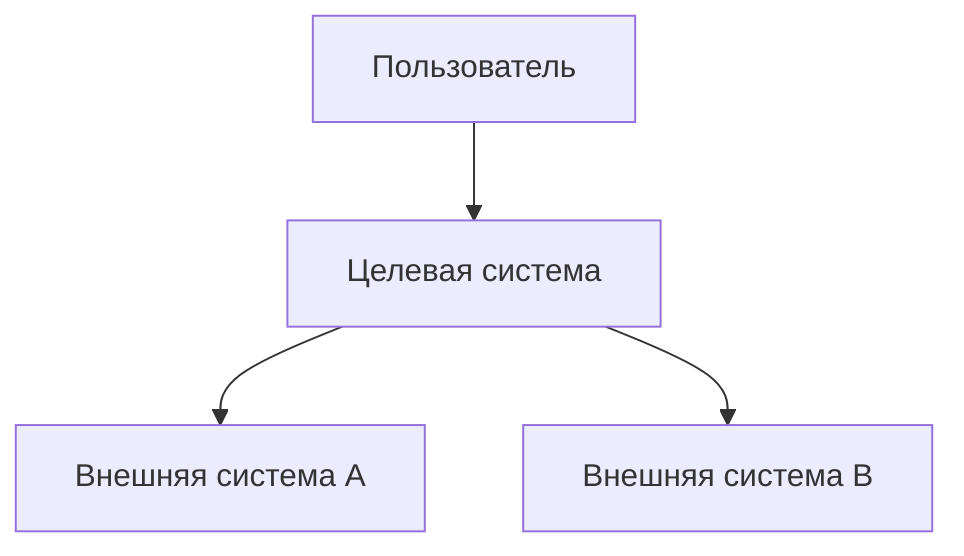

# Solution Concept: [Название проекта]

> Пример заполнения. Замените содержимое на актуальное для вашего проекта.

## Бизнес-контекст

<!-- Кратко: какую бизнес-задачу решаем, для кого, почему сейчас -->

TODO

## Границы решения

<!-- Что входит в скоуп, что не входит -->

TODO

## C4 Context

## Ключевые компоненты

<!-- Высокоуровневое описание основных блоков -->

TODO

## Предварительная оценка

| Параметр | Оценка |
|----------|--------|
| Сроки | TODO |
| Команда | TODO |
| Инфраструктура | TODO |
| Риски | TODO |

## Cost model (предварительный)

TODO
