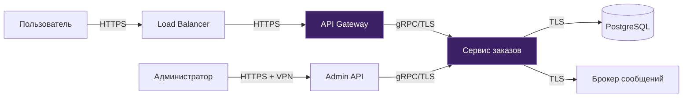

# Threat Model: [Название системы]

> Шаблон threat model на базе STRIDE + LINDDUN. Адаптируйте под ваш проект. См. [Security Architecture](../docs/practices.md#15-security-architecture) для методики.

---

## Метаданные

| Параметр | Значение |
|----------|---------|
| **Система** | [Название системы] |
| **Версия** | 1.0 |
| **Автор** | [Solution Architect / Security Specialist] |
| **Дата** | YYYY-MM-DD |
| **Статус** | Draft / Active / Requires update |
| **Уровень rigor** | [L1 / L2 / L3](../docs/core-standard.md#уровни-rigor) |

---

## Scope

**Система:** Система управления заказами
**Границы:** API Gateway → Backend сервисы → БД
**Регуляторика:** 152-ФЗ (обработка ПДн клиентов)

### Диаграмма потоков данных (DFD)



### Trust Boundaries

| Граница | Между | Защита |
|---------|------|--------|
| TB-1: External → DMZ | Пользователь → Load Balancer | WAF, TLS termination, rate limiting |
| TB-2: DMZ → Internal | API Gateway → Backend сервисы | mTLS, authentication, authorization |
| TB-3: Internal → Data | Backend → БД | TLS, credential rotation, network policy |
| TB-4: Admin → Internal | Администратор → Admin API | VPN + MFA, audit trail |

---

## Анализ угроз — STRIDE per Element

### C4 L1 — Context Level (Trust Boundaries)

| # | Угроза | Категория | Компонент | Вероятность | Влияние | Риск | Контрмера |
|---|--------|-----------|-----------|:-----------:|:-------:|:----:|-----------|
| T1 | Подбор учётных данных | Spoofing | API Gateway | Средняя | Высокое | Высокий | Rate limiting, MFA, блокировка после 5 попыток |
| T2 | DDoS | Denial of Service | Load Balancer | Высокая | Высокое | Высокий | WAF, rate limiting, auto-scaling |
| T3 | Неавторизованный доступ к Admin API | Spoofing | Admin API | Низкая | Критическое | Высокий | VPN + MFA, IP whitelist |

### C4 L2 — Container Level (Data Flows)

| # | Угроза | Категория | Компонент | Вероятность | Влияние | Риск | Контрмера |
|---|--------|-----------|-----------|:-----------:|:-------:|:----:|-----------|
| T4 | Перехват трафика между сервисами | Tampering | Внутренняя сеть | Низкая | Высокое | Средний | mTLS между сервисами, network policies |
| T5 | Утечка PII через логи | Information Disclosure | Logging pipeline | Средняя | Критическое | Критический | Маскирование PII в логах, structured logging |
| T6 | SQL injection через API | Tampering | Сервис заказов → БД | Средняя | Критическое | Критический | Parameterized queries, input validation, WAF rules |
| T7 | Отказ от действия | Repudiation | Сервис заказов | Средняя | Среднее | Средний | Audit log всех операций, подпись событий |
| T8 | Эскалация привилегий | Elevation of Privilege | Admin API | Низкая | Критическое | Высокий | RBAC, принцип наименьших привилегий, аудит |

### C4 L3 — Component Level (для критичных компонентов)

> Заполняется для компонентов с риском High/Critical на уровне L2.

| # | Угроза | Категория | Компонент | Вероятность | Влияние | Риск | Контрмера |
|---|--------|-----------|-----------|:-----------:|:-------:|:----:|-----------|
| T9 | Утечка данных через backup | Information Disclosure | PostgreSQL backup | Низкая | Критическое | Высокий | Encryption at rest (AES-256), secure backup storage |
| T10 | Tampering с событиями в MQ | Tampering | Брокер сообщений | Низкая | Высокое | Средний | Message signing, schema validation |

---

## LINDDUN — Privacy Threats

> Заполняется при обработке ПДн (152-ФЗ, GDPR). Для L2+.

| # | Угроза | Категория | Данные | Риск | Контрмера |
|---|--------|-----------|--------|:----:|-----------|
| P1 | Корреляция логов позволяет связать действия пользователя | Linkability | Access logs, audit logs | Средний | Pseudonymization в логах, отдельные correlation ID |
| P2 | Email/телефон в открытом виде в БД | Identifiability | Профиль пользователя | Высокий | Tokenization, отдельный identity vault |
| P3 | Передача данных в analytics без ведома пользователя | Unawareness | Поведенческие данные | Средний | Consent management, privacy notice |
| P4 | Нет процедуры удаления данных по запросу | Non-compliance | Все ПДн | Высокий | DSAR workflow, automated deletion pipeline |
| P5 | Данные хранятся дольше необходимого | Non-compliance | Заказы, профили | Средний | Data retention policy, TTL, lifecycle automation |

---

## Risk Matrix

| | Impact: Low | Impact: Medium | Impact: High | Impact: Critical |
|:---|:---:|:---:|:---:|:---:|
| **Likelihood: High** | Medium | High | **T2** High | Critical |
| **Likelihood: Medium** | Low | **T7** Medium | **T1, T8** High | **T5, T6** Critical |
| **Likelihood: Low** | Low | Low | **T4, T10** Medium | **T3, T9** High |

---

## Attack Tree (пример)

> Для L3. Визуализация ключевого сценария атаки.

**Цель: Получить данные клиентов (PII)**

```text
Получить данные клиентов [OR]
├── Через API [OR]
│   ├── SQL Injection (T6) → Input validation, WAF
│   ├── Broken Authentication (T1) → MFA, rate limiting
│   └── IDOR (прямая ссылка на объект) → Authorization checks
├── Через логи (T5) [AND]
│   ├── Получить доступ к logging pipeline
│   └── PII не замаскировано → PII masking
├── Через backup (T9) [AND]
│   ├── Получить доступ к storage
│   └── Backup не зашифрован → Encryption at rest
└── Через сотрудника [OR]
    ├── Компрометация VPN (T3) → MFA, IP whitelist
    └── Злоупотребление привилегиями (T8) → Least privilege, audit
```

---

## Контрмеры

### Реализованные

- [x] TLS 1.3 на всех соединениях
- [x] OAuth 2.0 + MFA для пользователей
- [x] RBAC для административного доступа
- [x] Audit log всех мутаций
- [x] Шифрование БД at rest (AES-256)
- [x] Parameterized queries (ORM)

### Запланированные

- [ ] WAF перед Load Balancer (Q2)
- [ ] SAST/SCA в CI pipeline (Sprint N)
- [ ] PII маскирование в логах (Sprint N+1)
- [ ] mTLS между сервисами (Sprint N+2)
- [ ] Consent management для 152-ФЗ (Q3)
- [ ] DSAR workflow (Q3)
- [ ] Пентест (Q2)

---

## Принятые риски

| Риск | Обоснование | Mitigation | Пересмотр |
|------|-------------|-----------|-----------|
| Нет WAF на старте | Бюджетные ограничения | Rate limiting на LB | Q2 |
| Нет mTLS между сервисами | Сервисы в private network | Network policies в K8s | Sprint N+2 |

---

## Связанные артефакты

- [Architecture Risk Register](risk-register.md) — security risks из этой модели
- [NFR Checklist](nfr-checklist.md) — Security категория
- [Integration Design](integration-design.md) — security аспекты интеграций
- [AI Policy](ai-policy.md) — если используются LLM
- [Data Contract](data-contract.md) — классификация данных, PII marking
